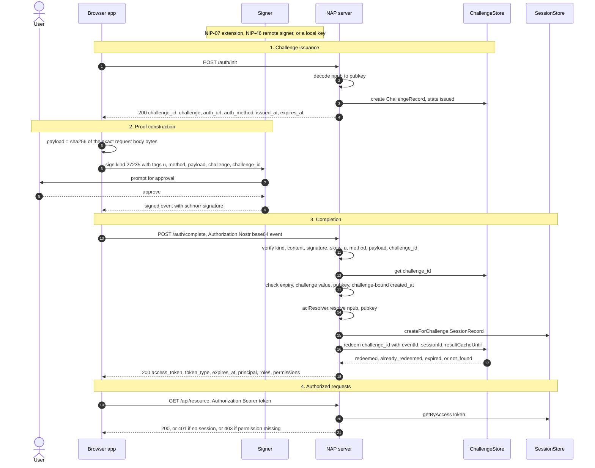

# NAP Integration Guide

A practical guide for engineers who already run a Nostr web app and need NAP for
authentication and authorisation.

This guide is written against the `nap` TypeScript monorepo at version **0.3.0**
(branch `develop`). Anything specified by the RFC but not present in the source is
marked explicitly.

**New to NAP? Read §0 first** — it covers what to decide before writing code, what
order to build in, and the four mistakes that each cost an afternoon.

## Table of contents

0. [Before you start](#0-before-you-start)
1. [What NAP is and the problem it solves](#1-what-nap-is-and-the-problem-it-solves)
2. [Protocol walkthrough](#2-protocol-walkthrough)
3. [Authorisation model](#3-authorisation-model)
4. [TypeScript package map](#4-typescript-package-map)
5. [Integration guide — TypeScript backend](#5-integration-guide--typescript-backend)
6. [Integration guide — frontend](#6-integration-guide--frontend)
7. [Integration guide — Java backend](#7-integration-guide--java-backend)
8. [Choosing between the two implementations](#8-choosing-between-the-two-implementations)
9. [Security considerations and operational notes](#9-security-considerations-and-operational-notes)
10. [Migration path](#10-migration-path)
11. [Current limitations and roadmap](#11-current-limitations-and-roadmap)
12. [Troubleshooting](#12-troubleshooting)

---

## 0. Before you start

The rest of this guide explains NAP thoroughly. This section is the part you need
first: what to decide before writing code, what order to build in, and the small
number of mistakes that cost real time.

### 0.1 The decision that shapes everything else

**Pick the signer first.** It determines your key-custody burden and is expensive
to change later.

| Signer | Key in your page? | Cost |
|---|---|---|
| NIP-07 extension (`createNip07Signer`) | No | Users need an extension installed |
| NIP-46 remote signer | No | **Not implemented** — spec only, `specs/001-nip46-signer-support/` |
| Local nsec (`createPrivateKeySessionSigner`) | Yes | You own encryption, eviction, and all of RFC §28 |

If you can live with NIP-07, take it. A local key means implementing a `KeyStore`
yourself — NAP ships the *interface*, not an implementation — plus WebCrypto
encryption and passphrase UX, and even then you cannot defend a key that is
unlocked while hostile script runs (§9.7, RFC §28.5).

### 0.2 The thing that most often surprises people

**The default session TTL is 900 seconds and refresh tokens are off by default.**
With a NIP-07 extension that means **a signing prompt every 15 minutes** until you
set `refreshTtlSeconds`, which registers `POST /auth/refresh` and starts issuing a
rotating refresh token alongside the access token (§2.5).

Your other lever is `sessionTtlSeconds`
(`packages/nap-server/src/server.ts:31`). Choose both deliberately and early — they
are a product decision wearing config parameters' clothes.

### 0.3 Four mistakes that each cost an afternoon

1. **A global body parser running before the NAP router.** The NIP-98 `payload` tag
   is `sha256(rawBody)`, so any middleware that re-serialises JSON breaks every
   completion with `NAP_COMPLETE_PAYLOAD_MISMATCH`. Mount NAP first (§5.2).
2. **A request-derived `getExternalBaseUrl`.** Get the audience wrong and *every*
   login fails as an indistinguishable 401. Use a pinned constant unless you are
   genuinely multi-domain (§9.4).
3. **No `AuditLogger`.** Every failure is an identical
   `401 {"status":"error","message":"authentication failed"}` — by design. Without
   the audit `code` you cannot debug any of them (§9.6).
4. **Missing `credentials: 'include'`.** `nap-client-web` is cookie-mode only, so
   every API call your app makes needs it (§6.1).

### 0.4 Build in this order

Each phase is independently verifiable, so a failure tells you which layer broke.

| Phase | Do | Done when |
|---|---|---|
| **0** | Router mounted, in-memory stores, bearer mode, pinned base URL, `AuditLogger` wired. No frontend. | `curl` completes `/auth/init` → `/auth/complete` and gets a session |
| **1** | Swap in `@imani/nap-store-postgres`; switch to cookie mode via `writeNapCookieSuccess` | Sessions survive a server restart; logout clears the cookie |
| **2** | `createNapSession` + `createNip07Signer`; `resume()` on mount; `isRestoringSession` loading state | Reload keeps you logged in without a signing prompt |
| **3** | Permission registry; `requirePermission` guards; `validatePermissions()` after routes register | A typo'd permission key fails at startup |
| **4** | `rateLimiter` wired; outstanding-challenge caps sized; `aclResolver` passed to the guards; cookie flags reviewed | `/auth/init` is no longer an uncapped write, and revoking access takes effect on the next request |

### 0.5 Checklist

**Before writing code**

- [ ] Signer chosen; if local key, you accept owning encryption and eviction (§0.1)
- [ ] `sessionTtlSeconds` chosen against the re-signing prompt (§0.2)
- [ ] Cookie or bearer decided — cookie if you use `nap-client-web` (§6.1)
- [ ] Permission registry drafted: roles and permissions named (§3)

**Server**

- [ ] `getExternalBaseUrl` is a constant or a Host allowlist (§9.4)
- [ ] NAP router mounted **before** any global body parser (§5.2)
- [ ] `AuditLogger` wired, `code` reaching your logs (§9.6)
- [ ] Durable store configured, with a plan for sweeping expired rows — `markExpired()` marks but never deletes (§5.4)
- [ ] `rateLimiter` sized for the deployment — the default is a per-process
      `createInMemoryRateLimiter()`, so more than one instance needs a shared
      backend behind the same interface (§9.5)
- [ ] Body size capped — the adapters default to 1 kB; override with `bodyLimit`
      (Express) / `bodyLimitBytes` (Fastify) (§9.5)
- [ ] `validatePermissions(registry)` called at startup (§5.2)

**Client**

- [ ] `credentials: 'include'` on every API call (§6.5)
- [ ] `resume()` on mount, with a loading state (§6.1)
- [ ] `destroy()` on unmount (§6.1)
- [ ] If holding a local key: `KeyStore` using WebCrypto AES-GCM under a slow KDF, and you have read what that does *not* buy (§9.7)

**Before shipping**

- [ ] HTTPS; cookie is `HttpOnly`, `Secure`, `SameSite` (§9.3)
- [ ] The cookie is set by `writeNapCookieSuccess` — the logout clear copies its attributes. A hand-rolled `writeSuccess` needs `clearCookieOptions` to match, or logout leaves a dead cookie (§6.1)
- [ ] `nostr-tools` deduped to a single copy (§11.4)
- [ ] Clock skew tolerance reviewed (§9.1)

### 0.6 Plan around these, not on them

- **`stepUp()` always throws.** Nothing issues a step-up token (§11.3).
- **Permissions are a login-time snapshot.** An ACL revocation takes up to one
  session TTL to take effect (§3.4).
- **Packages are not npm-publishable as they stand** — `exports` points at
  `./src/index.ts` and there is no build step, so you consume from the monorepo or
  vendor them (§11.4).

---

## 1. What NAP is and the problem it solves

NAP (Nostr Authentication Protocol) v2 is a **login profile**, not a new signing
format. It is a three-step challenge-response flow that turns possession of a
Nostr secret key into a short-lived, opaque bearer session your existing
application code can consume like any other session token.

The RFC states this up front (`docs/NAP-v2-RFC.md:13`): NAP is *"intentionally
not a replacement for NIP-98"*. It layers three things on top:

1. a server-issued challenge (`POST /auth/init`),
2. a completion step whose proof is a **standard NIP-98 `kind:27235` event**
   (`POST /auth/complete`),
3. session issuance for everything afterwards.

### Why not plain NIP-98 on every request

NIP-98 alone is a perfectly good per-request authorization scheme, and NAP does
not try to replace it for that. But using it as your *login* mechanism has three
practical problems:

- **A signature per request.** Every API call needs a fresh signed event. With a
  NIP-07 browser extension that is a user-visible permission prompt or, at best,
  a round trip to the extension. With a NIP-46 remote signer it is a relay round
  trip per request. Neither is acceptable for a chatty SPA.
- **No server-chosen nonce.** NIP-98's replay defence is a `created_at` window
  plus whatever the verifier remembers. There is no server-issued, single-use
  value that pins the proof to one specific login attempt. NAP adds
  `challenge` / `challenge_id` tags for exactly this, and tracks redemption
  state server-side (`ChallengeState` in
  `packages/nap-core/src/types.ts:40`).
- **No place to hang authorisation.** NIP-98 tells you *who* signed. It says
  nothing about whether that pubkey may use your service. NAP resolves roles and
  permissions once, at completion, and stamps them into the session
  (`SessionRecord.roles` / `.permissions`,
  `packages/nap-core/src/types.ts:61`).

### Why not just a bearer cookie with your own login

You almost certainly end up there anyway — NAP *issues* a bearer token. The
difference is what happens before the token exists. Without NAP you would invent
your own key-based login handshake, and the RFC's section 2
(`docs/NAP-v2-RFC.md:23`) is a list of the ways the previous draft got that
wrong: consuming challenges too early (breaking normal client retries), binding
sessions to `User-Agent + IP prefix`, and drifting away from the NIP-98 request
binding (`u`, `method`, `payload`). NAP's value is that those decisions are
already made, specified, and covered by tests.

### Where NAP sits relative to NIP-07 / NIP-46 / NIP-98

These are orthogonal layers, and it helps to name them separately:

| Layer | What it answers | Role in NAP |
|---|---|---|
| **NIP-07** | *How does the browser get a signature?* Window-injected extension (`window.nostr`). | One possible signer for the completion event. See `packages/nap-client-web/src/signers.ts`. |
| **NIP-46** | *How does a remote/bunker signer get a signature?* Relay-mediated remote signing. | An alternative signer. Status in 0.2.0 covered in §6. |
| **NIP-98** | *What does an HTTP authorization proof look like?* `kind:27235` event in an `Authorization: Nostr <base64>` header. | The wire format of NAP's completion proof, unchanged. |
| **NAP** | *How do I turn a key into a session?* | The challenge + completion + session flow around all of the above. |

NIP-07 and NIP-46 are interchangeable *signer transports*. NAP does not care
which produced the event, only that the event verifies. NIP-98 is the *proof
format*. NAP is the *login flow*.

### Scope boundaries

The RFC restricts itself to **HTTP over TLS** (`docs/NAP-v2-RFC.md:110`).
WebSocket and relay-native profiles (`NAP-WS`, `NAP-RELAY`) are named as possible
future work and are explicitly not specified — and not implemented. Account
recovery, key rotation, and delegation are listed as non-goals
(`docs/NAP-v2-RFC.md:44`).

---

## 2. Protocol walkthrough

Two endpoints, one session. The reference router mounts them as `/init` and
`/complete` under a base you choose (`createNapExpressRouter`,
`packages/nap-adapter-express/src/adapter.ts:228`), so mounting at `/auth` gives
you the RFC's `/auth/init` and `/auth/complete`.

### 2.1 Sequence



### 2.2 `POST /auth/init`

Request:

```http
POST /auth/init HTTP/1.1
Content-Type: application/json

{"npub":"npub1..."}
```

The handler only requires `npub` to be a string
(`packages/nap-adapter-express/src/adapter.ts:147`); the bech32 decode happens in
`issueChallenge()` via `nip19.decode`
(`packages/nap-server/src/server.ts:58`). A bad npub yields
`NAP_INIT_INVALID_NPUB`, which the Express adapter maps to **400
`{"status":"error","message":"bad request"}"`** (`adapter.ts:128`). Store failures
become `NAP_INIT_INTERNAL` → 500.

Success response — this is `AuthInitResponse`
(`packages/nap-core/src/types.ts:5`), emitted verbatim as the JSON body:

```json
{
  "challenge_id": "0GHtR2sVc1uNq3xB",
  "challenge": "P7l6W8J1N1c7Y5nGf7o7QK3W4dU2Nf8Q2D9q2nQ5c6Y",
  "auth_url": "https://api.example.com/auth/complete",
  "auth_method": "POST",
  "issued_at": 1710000000,
  "expires_at": 1710000060
}
```

Entropy actually used (`packages/nap-server/src/server.ts:179`):

- `challenge_id` — 12 random bytes, base64url
- `challenge` — 32 random bytes, base64url (meets the RFC's ≥32-byte requirement)

`auth_url` is not configured statically; the adapter computes it per request as
`getExternalBaseUrl(req) + '/auth/complete'`
(`packages/nap-adapter-express/src/adapter.ts:124`). Whatever that function
returns **is** the audience the client will sign, so it must be the externally
visible URL. See §9.

**Anti-enumeration.** `issueChallenge()` never consults the ACL — it issues a
challenge for any well-formed npub. ACL evaluation is deferred to completion
(`server.ts:282`), which is exactly what `docs/NAP-v2-RFC.md:171` asks for.

### 2.3 The completion proof

The client builds the proof with `buildAuthCompleteRequest()`
(`packages/nap-client-http/src/client.ts:46`). The order matters: serialize the
body **first**, hash those exact bytes, then sign.

```ts
import { buildAuthCompleteRequest, createPrivateKeySigner } from '@imani/nap-client-http';

const built = await buildAuthCompleteRequest({
  challenge,                                  // the AuthInitResponse, unmodified
  signer: createPrivateKeySigner(privateKeyHex),
});

// built.authorization -> "Nostr <base64 of the event JSON>"
// built.rawBody       -> the exact bytes you must send
await fetch(built.url, {
  method: built.method,
  headers: {
    'content-type': 'application/json',
    authorization: built.authorization,
  },
  body: built.rawBody,
});
```

The signed event is a plain NIP-98 `kind:27235` with five tags, in this order
(`client.ts:57`):

```json
{
  "kind": 27235,
  "created_at": 1710000005,
  "tags": [
    ["u", "https://api.example.com/auth/complete"],
    ["method", "POST"],
    ["payload", "<sha256 hex of the request body bytes>"],
    ["challenge", "<challenge from init, verbatim>"],
    ["challenge_id", "<challenge_id from init>"]
  ],
  "content": "",
  "pubkey": "…", "id": "…", "sig": "…"
}
```

Header: `Authorization: Nostr <base64(JSON.stringify(event))>` — standard base64,
not base64url (`client.ts:74`, decoded by
`parseNostrAuthorizationHeader`, `packages/nap-core/src/header.ts:22`).

**The raw-body rule is not optional.** `payload` is `sha256Hex(rawBody)`, and the
server hashes the bytes it received, not a reserialized object
(`packages/nap-core/src/validate.ts:122`). The Express adapter captures them via
`express.json({ verify })` into a symbol-keyed property
(`packages/nap-adapter-express/src/adapter.ts:136`), and
`createNapExpressCompleteHandler` **throws** if that parser did not run
(`adapter.ts:183`). Any middleware that reparses and reserializes the body before
NAP sees it will break payload verification.

### 2.4 Server-side validation order

Split across two functions. `verifyNip98Completion()`
(`packages/nap-core/src/validate.ts:57`) is store-free and checks, in order:

| # | Check | Failure code |
|---|---|---|
| 1 | `Authorization` header present | `NAP_COMPLETE_MISSING_AUTH_HEADER` |
| 2 | starts with `Nostr ` | `NAP_COMPLETE_INVALID_AUTH_SCHEME` |
| 3 | base64 decodes to a well-shaped event | `NAP_COMPLETE_INVALID_EVENT_JSON` |
| 4 | `kind === 27235` | `NAP_COMPLETE_INVALID_KIND` |
| 5 | `content === ''` | `NAP_COMPLETE_INVALID_EVENT_JSON` |
| 6 | `verifyEvent()` (id + schnorr sig) | `NAP_COMPLETE_INVALID_SIGNATURE` |
| 7 | `|now - created_at| <= maxClockSkewSeconds` (default 60) | `NAP_COMPLETE_CREATED_AT_OUT_OF_RANGE` |
| 8 | exactly one `u`, exact-match against the completion URL | `NAP_COMPLETE_URL_MISMATCH` |
| 9 | exactly one `method`, equals `req.method.toUpperCase()` | `NAP_COMPLETE_METHOD_MISMATCH` |
| 10 | exactly one `payload`, equals `sha256Hex(rawBody)` | `NAP_COMPLETE_PAYLOAD_MISMATCH` |
| 11 | exactly one `challenge_id`, equals the body's | `NAP_COMPLETE_MISSING_CHALLENGE_ID` |
| 12 | exactly one `challenge` tag present | `NAP_COMPLETE_CHALLENGE_MISMATCH` |

"Exactly one" is enforced by `getSingleTag()` (`validate.ts:13`) — a duplicated
required tag is a rejection, per `docs/NAP-v2-RFC.md:260`.

Then `verifyCompletion()` (`packages/nap-server/src/server.ts:213`) does the
stateful half:

| # | Check | Failure code |
|---|---|---|
| 13 | body parses and has a non-empty `challenge_id` | *malformed* → HTTP 400 |
| 14 | `challengeStore.get()` finds the record | `NAP_COMPLETE_UNKNOWN_CHALLENGE` |
| 15 | not past `expires_at`, state not `expired` | `NAP_COMPLETE_EXPIRED_CHALLENGE` |
| 16 | event `challenge` tag equals the stored challenge | `NAP_COMPLETE_CHALLENGE_MISMATCH` |
| 17 | event `pubkey` equals the pubkey decoded at init | `NAP_COMPLETE_PRINCIPAL_MISMATCH` |
| 18 | `issued_at - 30s <= created_at <= expires_at + 5s` | `NAP_COMPLETE_CREATED_AT_OUT_OF_RANGE` |
| 19 | `aclResolver.resolve(npub, pubkey)` returns `allowed` | `NAP_COMPLETE_ACL_DENIED` |
| 20 | session created, then challenge atomically redeemed | see §2.6 |

Note that step 17 is what makes `/auth/init`'s npub binding meaningful: you
cannot take a challenge issued for Alice and complete it with Bob's key.

Step 18 is a *second*, tighter time check on top of step 7 — step 7 bounds the
event against the server clock, step 18 bounds it against the specific
challenge's lifetime (`validateChallengeBoundCreatedAt`,
`packages/nap-core/src/validate.ts:43`). Both defaults come from
`packages/nap-server/src/server.ts:29`.

### 2.5 Session issuance

`createSessionRecord()` (`packages/nap-server/src/server.ts:109`):

- `session_id` — 24 random bytes, base64url
- `access_token` — 32 random bytes (256-bit), base64url, opaque
- `expires_at` — `now + sessionTtlSeconds`, default **900s / 15 min**
- `roles` and `permissions` copied from the `AclDecision`

The public body is `toPublicAuthSuccess()` (`server.ts:359`):

```json
{
  "status": "ok",
  "access_token": "…",
  "token_type": "Bearer",
  "expires_at": 1710000900,
  "principal": { "npub": "npub1…", "pubkey": "63fe…" },
  "roles": ["member"],
  "permissions": ["notes:read"]
}
```

> **`refresh_token` / `refresh_expires_at` appear only when the server is
> configured for them.** Set `refreshTtlSeconds` and the completion response
> carries both, and `POST /auth/refresh` is registered. Leave it unset — the
> default — and the fields are absent, the route does not exist, and the client
> re-runs the full flow when the access token expires. See §9.2.
>
> `step_up_token` / `step_up_expires_at` **are** populated as of 0.4.0, when the
> completion body carries `"step_up": true`. See §6.1.

### 2.6 Retry safety

This is the part the RFC calls out as the main fix over the previous draft
(`docs/NAP-v2-RFC.md:353`). The order in `verifyCompletion()` is deliberate:
**create the session first, then redeem** (`server.ts:289` and `server.ts:300`).
`redeem()` records `redeemed_event_id`, `redeemed_session_id`, and
`result_cache_until = now + resultCacheTtlSeconds` (default 30s).

`ChallengeStore.redeem()` returns one of four statuses
(`packages/nap-server/src/types.ts:54`), and the server branches:

- **`redeemed`** — first success. Return the new session.
- **`expired`** → `NAP_COMPLETE_EXPIRED_CHALLENGE`.
- **`not_found`** → `NAP_COMPLETE_UNKNOWN_CHALLENGE`.
- **`already_redeemed`** — the interesting case (`server.ts:325`). Re-read the
  challenge. If `redeemed_event_id` equals *this* request's event id, and
  `result_cache_until` has not passed, load the recorded session and return the
  **same** success response, flagged `retry: true` in the audit log. If the
  session row is missing, fail closed with `NAP_COMPLETE_INTERNAL`. Otherwise —
  a *different* event trying to reuse the challenge — reject with
  `NAP_COMPLETE_REDEEMED_CHALLENGE`.

So a lost response is safe to retry byte-for-byte within the result-cache
window, and only that. A replayed challenge with a different signature is a
generic failure.

One consequence worth knowing: because the session is created *before*
redemption, a losing racer in a concurrent double-submit can leave an orphan
`SessionRecord` behind. It is never returned to any client (the retry path
returns `redeemed_session_id`), but it does occupy a row until expiry.

### 2.7 Error surfacing

Everything the client sees is deliberately flat. The Express adapter
(`packages/nap-adapter-express/src/adapter.ts:199`) emits:

- **400** `{"status":"error","message":"bad request"}` — malformed body only
- **401** `{"status":"error","message":"authentication failed"}` — *every*
  `VerifyCompleteFailure`, from bad signature to ACL denial
  (`toPublicAuthFailure()`, `packages/nap-server/src/server.ts:376`)

The specific `NapErrorCode` never leaves the server. It goes to the
`AuditLogger` (`packages/nap-server/src/types.ts:93`), which is where you look
when debugging — see §12.

### 2.8 Carrying the session

`Authorization: Bearer <access_token>` or a cookie. `loadSession()`
(`packages/nap-adapter-express/src/adapter.ts:93`) tries the bearer header
first, then falls back to a cookie whose name defaults to `session`, and
rejects the token if `revoked_at` is set or `expires_at` has passed.

---

## 3. Authorisation model

NAP 0.2.0 ships a real ACL layer, added in commit `436a40e`. It is
role-based with per-principal overrides, scoped by `app_id`. All of it lives in
`packages/nap-server/src/acl.ts` and `packages/nap-server/src/types.ts`.

### 3.1 The three moving parts

**`PermissionRegistry`** (`packages/nap-server/src/types.ts:27`) — static
configuration you write in code. It declares every permission your app has and
every role that bundles them:

```ts
import type { PermissionRegistry } from '@imani/nap-server';

const registry: PermissionRegistry = {
  appId: 'possa-merchant',
  permissions: [
    { key: 'merchant:read',  description: 'Read merchant settings', stepUp: false },
    { key: 'voucher:create', description: 'Create vouchers',        stepUp: false },
    { key: 'stripe:manage',  description: 'Manage Stripe settings', stepUp: true  },
  ],
  roles: [
    { key: 'merchant', description: 'Full merchant access',
      permissions: ['merchant:read', 'voucher:create', 'stripe:manage'] },
    { key: 'readonly', description: 'Read-only access',
      permissions: ['merchant:read'] },
  ],
  defaultRole: 'merchant',
};
```

`validatePermissionRegistry()` (`packages/nap-server/src/acl.ts:42`) enforces
unique permission keys, unique role keys, that `defaultRole` is a declared role,
and that no role references an undeclared permission. It **throws** — call it at
startup and let the process die on a bad registry. Adapted from
`packages/nap-server/test/acl.test.ts:95`:

```
PermissionRegistry role 'merchant' references unknown permission 'voucher:create'
```

**`AclRecord`** (`packages/nap-server/src/types.ts:39`) — the per-principal row:

```ts
interface AclRecord {
  principal_pubkey: string;
  app_id: string;
  role: string;
  permission_overrides: { action: 'grant' | 'deny'; permission: string }[];
  suspended: boolean;
  suspended_at?: string;
  suspended_reason?: string;
  created_at?: string;
  updated_at?: string;
}
```

Note it is keyed on **hex `pubkey`**, not `npub`. `AclStore` is the CRUD
interface over these rows: `get`, `upsert`, `suspend`, `unsuspend`
(`types.ts:78`).

**`AclResolver`** (`packages/nap-server/src/types.ts:74`) — a one-method
interface, `resolve(npub, pubkey) => Promise<AclDecision>`. This is the only ACL
surface `verifyCompletion()` knows about (`server.ts:282`), so a bespoke
resolver is a legitimate integration route if the registry model does not fit.

### 3.2 `createRegistryAclResolver` semantics

`createRegistryAclResolver(registry, aclStore, options?)`
(`packages/nap-server/src/acl.ts:140`) wires the three together. Behaviour, in
evaluation order:

1. Look up `aclStore.get(pubkey, registry.appId)`.
2. **No record + `autoProvision: true` (the default)** → write a new record with
   `role = registry.defaultRole`, no overrides, not suspended; log
   `nap.acl.auto_provisioned`; re-read it. **Any valid Nostr key that reaches
   completion becomes a `defaultRole` user.** If you want an allowlist, you must
   pass `autoProvision: false`.
3. No record + `autoProvision: false` → `denied('no_acl_record')`.
4. `record.suspended` → `denied('suspended')`.
5. Record's `role` not in the registry → `warn` + `denied('unknown_role')`.
   (This is the "role deleted from config but still in the database" case.)
6. Otherwise allow, with `roles: [record.role]` and permissions computed by
   `applyOverrides()`.

`applyOverrides()` (`acl.ts:68`) — **deny wins, unconditionally**, regardless of
ordering. Grants are collected into a set, denies into another, then denies are
subtracted and the result is sorted. The test at
`packages/nap-server/test/acl.test.ts:47` grants and then denies
`stripe:manage` and the permission is absent from the result.

Note the shape: `AclDecision.roles` is an array, but the registry resolver
always returns exactly one role (`allowed()`, `acl.ts:96`). Multi-role
principals are representable in the type but not in this resolver.

The `npub` argument is accepted and **ignored** (`acl.ts:153`, it is named
`_npub`). Everything keys on hex pubkey.

### 3.3 Enforcement at request time

The adapters ship two guards. Express
(`packages/nap-adapter-express/src/adapter.ts:238`):

```ts
import { requirePermission, requireStepUp } from '@imani/nap-adapter-express';

app.post('/vouchers', requirePermission('voucher:create', { sessionStore }), handler);
```

`requirePermission` loads the session (bearer or cookie), returns **401** if
there is no valid session, **403** `{"status":"error","message":"forbidden"}` if
`session.permissions` does not include the key, else `next()`.

It also has a startup-safety side effect: every permission string passed to
`requirePermission` is recorded in a module-level set, and
`validatePermissions(registry)` (`adapter.ts:295`) fails if any of them is
missing from the registry:

```
Permissions used in middleware but missing from registry: voucher:create
```

Call it after your routes are registered. `resetPermissionValidationState()`
(`adapter.ts:310`) exists to clear the module-global between test runs.

**`requireRole` exists, but reach for `requirePermission` first.**

```ts
app.get('/admin/keys', requireRole(['admin', 'owner'], { sessionStore }), handler);
```

A role is a named set of permissions — `RoleDefinition` is
`{ key, description, permissions[] }` (`packages/nap-server/src/types.ts:21`) and
the ACL resolver expands roles into `session.permissions` at login. So every role
check is expressible as a permission check, and the two differ in which direction
change flows:

- `requirePermission('voucher:issue')` — a new role that should have access is
  **one registry edit**; the guard is untouched.
- `requireRole('merchant')` — the same change means **editing every guard site**
  that should now also accept the new role.

The registry exists to centralise that mapping, and role guards route around it.
The failure is silent: the new role holds every permission it needs and the route
still refuses it. RFC `§15.1` (`docs/NAP-v2-RFC.md:475`) states the preference,
and the legitimate exception — break-glass and staff-only routes, where the role
genuinely *is* what is being authorised.

Two practical notes:

- **Pass an array for any-of.** Chaining middleware gives you AND, so
  `['admin', 'owner']` is the only way to express OR without hand-rolling a check
  — and a hand-rolled `session.roles.includes()` gets no startup validation.
- **Role keys are validated too.** `requireRole` registers into its own set and
  `validatePermissions(registry)` fails on a key missing from `registry.roles`:
  `Roles used in middleware but missing from registry: amin`. That is the real
  reason to prefer the guard over an inline check — a typo'd role otherwise fails
  closed forever and looks exactly like a legitimate denial.

`session.roles` is a login-time snapshot, exactly like `session.permissions`, so
a role revoked mid-session stays effective until the session TTL expires (§3.4).

`createPermissionsRouter(registry)` (`adapter.ts:314`) exposes the registry
verbatim at `GET /permissions` — handy for a frontend that wants to render
capability-gated UI.

### 3.4 Keeping authorization live

The RFC's section 15 (`docs/NAP-v2-RFC.md:460`) states three rules. Measured
against 0.4.0:

| RFC rule | Status in 0.4.0 |
|---|---|
| "ACL checks MUST happen after proof verification and before session issuance" | **Implemented.** The `aclResolver.resolve()` call sits between the proof checks and `createForChallenge()`. |
| "permissions are evaluated on every authorized application request, not just at login" | **Implemented, opt-in per guard.** Pass `aclResolver` in the guard options and `requirePermission()` / `requireRole()` re-read the ACL per request via `resolveEffectiveAcl()`. Omit it and they keep reading the login-time snapshot. |
| "removing a principal from the ACL SHOULD revoke active sessions" | **Implemented two ways.** A guard with `aclResolver` revokes the principal's sessions the moment a request finds them denied; `createRevokingAclStore(aclStore, sessionStore)` revokes at the point of the ACL write instead, so it does not wait for a request. |
| "role changes SHOULD take effect without forcing a new login" | **Implemented.** With `aclResolver` on the guard, the new roles are in force on the next request. |

Both mechanisms are opt-in because both cost something. The per-request resolver
costs one ACL read per guarded request; the revoking store logs a principal out
on any role change. Wire one, the other, or both:

```ts
// Per-request evaluation — a principal who lost access is denied on their next
// request, and their sessions are revoked so the following one fails earlier.
app.get('/vouchers', requirePermission('voucher:issue', {
  sessionStore,
  aclResolver,   // the same resolver you gave NapServerOptions
  registry,      // enforces `stepUp: true` on the permission definition
}), handler);

// Revoke at the write instead of at the read.
const aclStore = createRevokingAclStore(new PostgresAclStore(pool), sessionStore);
```

`createRevokingAclStore` revokes on `suspend()` and on a role change, but **not**
on a permission-override edit: those are picked up per-request by a guard with an
`aclResolver`, and logging everyone out because a permission was *granted* is
worse than the delay it avoids.

Note that `requireStepUp()` and the `registry` option are the two halves of
step-up: `PermissionDefinition.stepUp` is now enforced by `requirePermission()`
when you pass the registry, rather than needing `requireStepUp()` remembered at
every call site. See §6.1 for how a client obtains the token.

---

## 4. TypeScript package map

Eight npm-workspace packages, all published under the `@imani/` scope at version
`0.2.0`. Note that every `package.json` points `exports` and `types` at
`./src/index.ts` — **these packages ship TypeScript source, not compiled
JavaScript.** Your build must transpile them; a plain `node dist/server.js`
against a `tsc`-emitted app will not resolve them as-is.

| Package | Purpose | Key exports | Dependencies | When you'd use it |
|---|---|---|---|---|
| **`@imani/nap-core`** | Protocol types, base64/hex codecs, SHA-256, NIP-98 header parsing and completion validation. No I/O, no store. | `verifyNip98Completion`, `validateCreatedAtWindow`, `validateChallengeBoundCreatedAt`, `parseNostrAuthorizationHeader`, `sha256Hex`, `utf8Bytes`, `exactUrlMatch`, `normalizeAbsoluteUrl`, `encodeBase64String`/`decodeBase64String`, `hexToBytes`/`bytesToHex`, `failure`, `isRetryableNapError`; types `AuthInitResponse`, `AuthSuccessResponse`, `ChallengeRecord`, `SessionRecord`, `AclDecision`, `NapErrorCode`, `Nip98Event` | `@noble/hashes`, `nostr-tools` | Transitively, always. Directly only if you are writing your own adapter or verifying NIP-98 proofs outside the NAP flow. |
| **`@imani/nap-server`** | The protocol engine: challenge issuance, retry-safe completion, session minting, registry ACL, in-memory stores. Framework-agnostic. | `createNapServer`, `issueChallenge`, `verifyCompletion`, `toPublicAuthSuccess`, `toPublicAuthFailure`, `createRegistryAclResolver`, `validatePermissionRegistry`, `InMemoryChallengeStore`, `InMemorySessionStore`, `InMemoryAclStore`, `createSystemClock`, `createNodeRandomSource`, `createNoopAuditLogger`, `isMalformedRequestFailure`/`isVerifyFailure`/`isVerifySuccess`; types `NapServerOptions`, `ChallengeStore`, `SessionStore`, `AclStore`, `AclResolver`, `PermissionRegistry`, `AuditLogger` | `@imani/nap-core`, `nostr-tools` | Every backend. If your framework is neither Express nor Fastify, this plus ~60 lines of glue is the whole integration. |
| **`@imani/nap-adapter-express`** | Express 4 router, raw-body-preserving JSON parser, permission/step-up guards, cookie writer. | `createNapExpressRouter`, `createNapExpressInitHandler`, `createNapExpressCompleteHandler`, `createNapExpressJsonParser`, `requirePermission`, `requireStepUp`, `validatePermissions`, `resetPermissionValidationState`, `createPermissionsRouter`, `writeNapCookieSuccess`, `createRequestDerivedBaseUrlResolver`; types `NapExpressOptions`, `NapExpressGuardOptions` | `@imani/nap-server`, `express ^4.21.2` | Express backends. Note the pinned major: `express ^4`, while `@types/express ^5` is the devDependency. |
| **`@imani/nap-adapter-fastify`** | Same surface as the Express adapter, as a Fastify 5 plugin. | `napFastifyPlugin`, `permissionsFastifyPlugin`, `createNapFastifyInitHandler`, `createNapFastifyCompleteHandler`, `requirePermission`, `requireStepUp`, `validatePermissions`, `resetPermissionValidationState`, `writeNapCookieSuccess`, `createRequestDerivedBaseUrlResolver`; types `NapFastifyOptions`, `NapFastifyGuardOptions` | `@imani/nap-server`, `fastify ^5.2.1`, `cookie ^1.0.2` | Fastify backends. |
| **`@imani/nap-store-postgres`** | Postgres-backed implementations of the three store interfaces, with `redeem()` done as a conditional `UPDATE` for cross-instance atomicity. | `PostgresChallengeStore`, `PostgresSessionStore`, `PostgresAclStore` | `@imani/nap-core`, `@imani/nap-server`, `pg ^8.13.1` | Any deployment with more than one server process. The in-memory stores are single-process only. |
| **`@imani/nap-client-http`** | Builds the completion request. Runtime-agnostic (no DOM, no Node built-ins beyond what `nostr-tools` needs). | `buildAuthCompleteRequest`, `serializeAuthCompleteBody`, `createPrivateKeySigner`; types `EventSigner`, `BuildAuthCompleteRequestInput`, `BuiltAuthCompleteRequest` | `@imani/nap-core`, `nostr-tools` | Server-to-server clients, CLI tools, tests. In a browser you get this transitively via `nap-client-web`. |
| **`@imani/nap-client-web`** | Browser session manager: signer abstraction, in-memory token holding, cross-tab broadcast, idle lock, re-unlock. | `createNapSession`, `createNip07Signer`, `createPrivateKeySessionSigner`, `reunlock`, `ReunlockError`, `SessionLockedError`; types `NapSession`, `NapClientOptions`, `SessionSigner`, `SessionState`, `KeyStore` | `@imani/nap-client-http`, `@imani/nap-core`, `nostr-tools` | Any browser app. Framework-independent — usable from Vue/Svelte/vanilla, not just React. |
| **`@imani/nap-react`** | Thin React binding over `nap-client-web`. | `NapProvider`, `useNapSession`, `useNapCallbacks`, `useReunlock`, `ReunlockCancelledError`; types `NapProviderProps`, `NapSessionState`, `UseReunlockReturn` | `@imani/nap-client-web`; peer `react >=18` | React apps. Everything here is ~250 lines over `createNapSession()` — skip it if you already have your own state layer. |

### Dependency shape

```text
nap-core ──┬── nap-server ──┬── nap-adapter-express
           │                ├── nap-adapter-fastify
           │                └── nap-store-postgres
           └── nap-client-http ── nap-client-web ── nap-react
```

Server and client trees meet only at `nap-core`. Nothing in the client tree
imports `nap-server`, so bundle size is not a concern from that direction.

### Minimum viable set

- **Express backend + React frontend:** `@imani/nap-adapter-express`,
  `@imani/nap-store-postgres`, `@imani/nap-react`. The rest arrive transitively.
- **Non-Express backend:** `@imani/nap-server` only.
- **Just verifying a NIP-98 proof, no NAP flow:** `@imani/nap-core` only.

---

## 5. Integration guide — TypeScript backend

Both adapters follow the same shape: build a `NapServerOptions` (three stores +
an ACL resolver), mount the routes, then guard your own routes with
`requirePermission`. The samples below are adapted from the adapter test suites,
which are the authoritative working examples
(`packages/nap-adapter-express/test/adapter.test.ts`,
`packages/nap-adapter-fastify/test/adapter.test.ts`).

### 5.1 Shared setup

```ts
// nap-setup.ts
import {
  createRegistryAclResolver,
  InMemoryAclStore,
  InMemoryChallengeStore,
  InMemorySessionStore,
  validatePermissionRegistry,
  type NapServerOptions,
  type PermissionRegistry,
} from '@imani/nap-server';

export const registry: PermissionRegistry = {
  appId: 'my-app',
  permissions: [
    { key: 'notes:read',  description: 'Read notes',  stepUp: false },
    { key: 'notes:write', description: 'Write notes', stepUp: false },
  ],
  roles: [
    { key: 'member', description: 'Standard user', permissions: ['notes:read', 'notes:write'] },
    { key: 'reader', description: 'Read only',     permissions: ['notes:read'] },
  ],
  defaultRole: 'member',
};

// Throws on a malformed registry. Do this before the server binds a port.
validatePermissionRegistry(registry);

const aclStore = new InMemoryAclStore();

export const sessionStore = new InMemorySessionStore();

export const napServerOptions: NapServerOptions = {
  challengeStore: new InMemoryChallengeStore(),
  sessionStore,
  aclResolver: createRegistryAclResolver(registry, aclStore, {
    // Default is true: any valid key becomes a `defaultRole` user.
    // Set false for a closed allowlist.
    autoProvision: true,
  }),
  // All optional; defaults shown (packages/nap-server/src/server.ts:29)
  challengeTtlSeconds: 60,
  sessionTtlSeconds: 900,
  resultCacheTtlSeconds: 30,
  maxClockSkewSeconds: 60,
  lowerBoundGraceSeconds: 30,
  upperBoundGraceSeconds: 5,
  auditLogger: {
    log(event) {
      console.log(JSON.stringify({ at: 'nap', ...event }));
    },
  },
};
```

`clock` and `randomSource` are also injectable
(`packages/nap-server/src/types.ts:108`); the defaults are `Date.now()` and
`node:crypto.randomBytes`. Override them in tests, not in production.

### 5.2 Express

```ts
import express from 'express';
import {
  createNapExpressRouter,
  createPermissionsRouter,
  createRequestDerivedBaseUrlResolver,
  requirePermission,
  validatePermissions,
} from '@imani/nap-adapter-express';
import { napServerOptions, registry, sessionStore } from './nap-setup.js';

const app = express();

// Required if you terminate TLS at a load balancer — see §9.
app.set('trust proxy', true);

app.use(
  '/auth',
  createNapExpressRouter({
    server: napServerOptions,
    getExternalBaseUrl: createRequestDerivedBaseUrlResolver(),
  })
);

app.use('/auth', createPermissionsRouter(registry)); // GET /auth/permissions

app.get('/api/notes', requirePermission('notes:read', { sessionStore }), (req, res) => {
  res.json({ notes: [] });
});

// After all routes are registered: fails fast if a guard uses an
// undeclared permission key.
validatePermissions(registry);

app.listen(3000);
```

`createNapExpressRouter()` mounts `POST /init` and `POST /complete` relative to
the mount point, and installs `createNapExpressJsonParser()` on the router
itself (`packages/nap-adapter-express/src/adapter.ts:231`).

**The one Express footgun:** if you call `app.use(express.json())` globally
*before* mounting the NAP router, Express's body parser will have already
consumed the stream and NAP's raw-body capture never fires — the complete
handler throws `nap-adapter-express requires createNapExpressJsonParser()
before /auth/complete handlers` (`adapter.ts:184`), which surfaces as a 500. Two
fixes: mount NAP before your global parser, or replace the global parser with
`createNapExpressJsonParser()` (it is `express.json()` plus a `verify` hook, so
it is a drop-in).

**Cookie mode.** Instead of returning the token in the body, set it as a cookie
(from `packages/nap-adapter-express/test/adapter.test.ts:135`):

```ts
import { writeNapCookieSuccess } from '@imani/nap-adapter-express';

createNapExpressRouter({
  server: napServerOptions,
  getExternalBaseUrl: createRequestDerivedBaseUrlResolver(),
  writeSuccess: writeNapCookieSuccess('session', {
    httpOnly: true,
    secure: true,
    sameSite: 'lax',
  }),
});
```

The response body collapses to `{"status":"ok"}` and `Set-Cookie: session=…` is
added. A third argument lets you keep part of the body — e.g.
`writeNapCookieSuccess('session', opts, (body) => ({ status: 'ok', principal: body.principal, permissions: body.permissions }))`
so the SPA can render without a second round trip. The guards read the cookie
automatically (`cookieName` defaults to `session`).

`writeFailure` is the matching hook for the 401 path
(`adapter.ts:33`); it receives the internal `VerifyCompleteFailure` including
the `NapErrorCode`, which is useful for metrics. Do not leak the code to the
client.

### 5.3 Fastify

```ts
import Fastify from 'fastify';
import {
  createRequestDerivedBaseUrlResolver,
  napFastifyPlugin,
  permissionsFastifyPlugin,
  requirePermission,
  validatePermissions,
} from '@imani/nap-adapter-fastify';
import { napServerOptions, registry, sessionStore } from './nap-setup.js';

const app = Fastify({ trustProxy: true });

await app.register(napFastifyPlugin, {
  routePrefix: '/auth',
  server: napServerOptions,
  getExternalBaseUrl: createRequestDerivedBaseUrlResolver(),
});

await app.register(permissionsFastifyPlugin(registry), { prefix: '/auth' });

app.get(
  '/api/notes',
  { preHandler: requirePermission('notes:read', { sessionStore }) },
  async () => ({ notes: [] })
);

validatePermissions(registry);

await app.listen({ port: 3000 });
```

Differences from Express worth knowing:

- Route placement uses the plugin's own **`routePrefix` option**, not Fastify's
  `prefix` register option (`packages/nap-adapter-fastify/src/adapter.ts:257`).
  It is concatenated into the route path directly.
- Raw body capture is an `addContentTypeParser('application/json', { parseAs: 'buffer' })`
  registered on the instance the plugin receives (`adapter.ts:231`). Because
  Fastify plugins are encapsulated by default, registering `napFastifyPlugin`
  without `fastify-plugin` scopes that parser to the plugin's context. That is
  what you want — it keeps NAP's parser off the rest of your app — but it also
  means the parser will not help any other route.
- Guards are `preHandlerHookHandler`s, so pass them via
  `{ preHandler: … }`, not as positional middleware.
- `writeNapCookieSuccess` takes `cookie`'s `SerializeOptions` and writes the
  header itself via `serialize()` (`adapter.ts:146`) — no `@fastify/cookie`
  needed for the write path, and the guards parse the `Cookie` header manually
  too.

The `requirePermission` / `requireStepUp` / `validatePermissions` /
`resetPermissionValidationState` exports are **per-adapter module state**. Do not
mix imports from both adapter packages in one process; each has its own
`REGISTERED_PERMISSIONS` set.

### 5.4 Store choice

| | `InMemory*Store` | `Postgres*Store` |
|---|---|---|
| Package | `@imani/nap-server` | `@imani/nap-store-postgres` |
| Atomic `redeem()` across instances | No — single process only | Yes, conditional `UPDATE … WHERE state = 'issued'` |
| Survives restart | No | Yes |
| Expiry sweeping | `markExpired(now)`, must be called by you | same |
| Use for | tests, local dev, single-process demos | anything with >1 process, anything you can't lose sessions from |

Switching is a constructor swap:

```ts
import { Pool } from 'pg';
import {
  PostgresAclStore,
  PostgresChallengeStore,
  PostgresSessionStore,
} from '@imani/nap-store-postgres';

const pool = new Pool({ connectionString: process.env.DATABASE_URL });

const napServerOptions: NapServerOptions = {
  challengeStore: new PostgresChallengeStore(pool),
  sessionStore:   new PostgresSessionStore(pool),
  aclResolver:    createRegistryAclResolver(registry, new PostgresAclStore(pool)),
};
```

Each store takes a `Pool` **or** a `PoolClient` (`type Queryable = Pool | PoolClient`,
`packages/nap-store-postgres/src/index.ts:12`), so you can hand them a
transaction-bound client if you need to.

Neither `markExpired()` implementation is called automatically. Run it on a
timer if you care about the `nap_challenges` table not growing:

```ts
setInterval(() => {
  void challengeStore.markExpired(Math.floor(Date.now() / 1000));
}, 60_000).unref();
```

Note `markExpired()` only flips `state` to `'expired'`; it never deletes rows.
Expired sessions are not swept at all — `getByAccessToken()` filters on
`revoked_at IS NULL` and the adapter checks `expires_at` in application code
(`packages/nap-adapter-express/src/adapter.ts:117`), so stale rows accumulate.
Add your own `DELETE` job.

### 5.5 Postgres schema

> **There is no migration file or DDL constant in the repo.** I checked: no
> `.sql` files, and no `CREATE TABLE` string anywhere under `packages/`. The
> only DDL in the repo is an application-specific `merchant_sessions` example in
> `docs/NAP-IMPLEMENTATION-BEST-PRACTICES.md:315`, which is **not** the NAP
> store schema. You must write the migration yourself.

The schema is fully determined by the queries in
`packages/nap-store-postgres/src/index.ts`. The following is **reconstructed from
those queries, not quoted from the repo** — every column name and constraint
below is required by a specific statement, cited inline:

```sql
-- Columns and constraints derived from packages/nap-store-postgres/src/index.ts.
-- NOT shipped by the repo; verify against the source before relying on it.

CREATE TABLE nap_challenges (
  challenge_id        TEXT PRIMARY KEY,          -- INSERT/SELECT/UPDATE key, L124/L143/L157
  challenge           TEXT NOT NULL,
  npub                TEXT NOT NULL,
  pubkey              TEXT NOT NULL,
  auth_url            TEXT NOT NULL,
  auth_method         TEXT NOT NULL,             -- always 'POST' in 0.2.0
  state               TEXT NOT NULL,             -- issued | redeemed | expired | failed_terminal
  issued_at           BIGINT NOT NULL,           -- unix seconds, compared numerically at L157
  expires_at          BIGINT NOT NULL,
  redeemed_event_id   TEXT,                      -- set by redeem(), L154
  redeemed_session_id TEXT,                      -- set by redeem(), L155
  result_cache_until  BIGINT,                    -- set by redeem(), L156
  client_ip           TEXT,                      -- per-IP outstanding cap; NULL when the
                                                 -- adapter opts out of address reporting
  failure_count       INTEGER NOT NULL DEFAULT 0 -- RFC §13.4 budget, incremented by
                                                 -- recordFailure()
);

CREATE TABLE nap_sessions (
  session_id        TEXT PRIMARY KEY,            -- findBy('session_id'), L265
  challenge_id      TEXT NOT NULL UNIQUE,        -- REQUIRED: ON CONFLICT (challenge_id), L205
  access_token      TEXT NOT NULL UNIQUE,        -- findBy('access_token'), L265
  principal_npub    TEXT NOT NULL,
  principal_pubkey  TEXT NOT NULL,               -- revokeByPrincipal filter, L257
  roles             JSONB NOT NULL,              -- cast $6::jsonb at L204
  permissions       JSONB NOT NULL,              -- cast $7::jsonb at L204
  issued_at         BIGINT NOT NULL,
  expires_at        BIGINT NOT NULL,
  step_up_token     TEXT,
  step_up_expires_at BIGINT,
  refresh_token     TEXT UNIQUE,                 -- RFC §14.1; NULL unless refreshTtlSeconds is set
  refresh_expires_at BIGINT,
  previous_refresh_token TEXT,                   -- the one token of history that makes a
                                                 -- replay detectable; rotated in by
                                                 -- rotateRefreshToken()
  revoked_at        BIGINT                       -- NULL = live; filtered at L248/L257/L271
);

CREATE TABLE nap_acl (
  app_id               TEXT NOT NULL,
  pubkey               TEXT NOT NULL,            -- note: column is `pubkey`, mapped to
                                                 -- AclRecord.principal_pubkey at L107
  role                 TEXT NOT NULL,
  permission_overrides JSONB NOT NULL,           -- cast $4::jsonb at L295
  suspended            BOOLEAN NOT NULL DEFAULT FALSE,
  suspended_at         TIMESTAMPTZ,              -- written with NOW(), L319
  suspended_reason     TEXT,
  created_at           TIMESTAMPTZ DEFAULT NOW(),
  updated_at           TIMESTAMPTZ DEFAULT NOW(),
  PRIMARY KEY (app_id, pubkey)                   -- REQUIRED: ON CONFLICT (app_id, pubkey), L296
);

CREATE INDEX idx_nap_sessions_principal ON nap_sessions (principal_pubkey);

-- getByRefreshToken() matches either column, so both need an index or every
-- refresh is a sequential scan of the session table.
CREATE INDEX idx_nap_sessions_refresh_token ON nap_sessions (refresh_token);
CREATE INDEX idx_nap_sessions_prev_refresh_token ON nap_sessions (previous_refresh_token);
CREATE INDEX idx_nap_challenges_expiry  ON nap_challenges (expires_at) WHERE state = 'issued';

-- countOutstanding() runs on every /auth/init. Without these it is a sequential
-- scan of the whole challenge table on the hottest unauthenticated path.
CREATE INDEX idx_nap_challenges_npub ON nap_challenges (npub) WHERE state = 'issued';
CREATE INDEX idx_nap_challenges_ip   ON nap_challenges (client_ip) WHERE state = 'issued';
```

Three things that will bite you if you get the schema wrong:

1. **`nap_sessions.challenge_id` must be `UNIQUE`.** Without it the
   `ON CONFLICT (challenge_id) DO NOTHING` at
   `packages/nap-store-postgres/src/index.ts:205` is a syntax error at runtime,
   and the idempotent "one session per challenge" guarantee disappears.
2. **`nap_acl` must have a unique `(app_id, pubkey)`.** Same reason
   (`index.ts:296`).
3. **Timestamps are mixed.** `nap_challenges` and `nap_sessions` use **unix
   seconds as integers** (they are compared against `$5`/`params.now` numerically
   at `index.ts:157`). `nap_acl.suspended_at` / `created_at` / `updated_at` are
   written with SQL `NOW()` and read back as **strings**
   (`row.suspended_at as string | undefined`, `index.ts:112`). Do not
   standardise them onto one type.

The two `SELECT *` queries (`index.ts:143`, `index.ts:284`) mean extra columns
are harmless — the row mappers pick fields by name.

### 5.6 Neither Express nor Fastify?

The adapters are thin. `createNapServer(options)` returns four methods
(`packages/nap-server/src/types.ts:119`) and the whole integration is:

```ts
import { createNapServer, isMalformedRequestFailure, isVerifyFailure } from '@imani/nap-server';

const nap = createNapServer(napServerOptions);

// POST /auth/init
const issued = await nap.issueChallenge({
  npub,
  authUrl: 'https://api.example.com/auth/complete',
  authMethod: 'POST',
});
if (!issued.ok) { /* NAP_INIT_INVALID_NPUB -> 400, NAP_INIT_INTERNAL -> 500 */ }
else { /* respond 200 with issued.value */ }

// POST /auth/complete
const result = await nap.verifyCompletion({
  authorization: headers.authorization,
  method: 'POST',
  url: 'https://api.example.com/auth/complete', // must be byte-identical to authUrl above
  rawBody,                                       // Uint8Array of the UNPARSED body
});

if (isMalformedRequestFailure(result)) {
  respond(result.publicResponse.status, result.publicResponse.body);
} else if (isVerifyFailure(result)) {
  const { status, body } = nap.toPublicAuthFailure();
  respond(status, body);                          // always 401, always generic
} else {
  respond(200, nap.toPublicAuthSuccess(result.session));
}
```

The only non-obvious requirement is `rawBody`: your framework must give you the
undecoded request bytes.

---

## 6. Integration guide — frontend

### 6.1 `createNapSession` — read this first

`@imani/nap-client-web` is **cookie-mode only.** Every request it makes goes
through `fetchJson()`, which hard-codes `credentials: 'include'`
(`packages/nap-client-web/src/httpClient.ts:14`) and never sets an
`Authorization: Bearer` header. The returned `access_token` is discarded — only
`principal`, `roles`, `permissions`, and `expires_at` are kept
(`toSessionState()`, `packages/nap-client-web/src/session.ts:18`).

**So your backend must run in cookie mode** (`writeNapCookieSuccess`, §5.2/§5.3)
for this package to work. If you want bearer-token mode in the browser, use
`@imani/nap-client-http` directly and manage the token yourself.

`NapClientOptions` (`packages/nap-client-web/src/types.ts:17`):

```ts
import { createNapSession, createNip07Signer } from '@imani/nap-client-web';

const session = createNapSession({
  baseUrl: 'https://api.example.com',   // '/auth/init' etc. are appended
  signer: createNip07Signer(window.nostr!),

  autoLock: {
    enabled: true,
    timeoutMs: 15 * 60 * 1000,          // default when enabled
    shutdownTimeoutMs: 60 * 60 * 1000,  // optional second, longer timer
  },
  broadcast: { enabled: true, channelName: 'nap-session' }, // default: enabled

  onLogout:         () => {},
  onLock:           () => {},
  onUnlock:         () => {},
  onShutdown:       () => {},
  onSessionExpired: () => {},

  keyStore: myKeyStore,   // only needed for session.reunlock()
  fetch: window.fetch,    // injectable for tests
});
```

There is **no cookie option**. Through 0.5.0 the type declared
`cookie?: { name?: string }` and `createNapSession()` never read it; rather than
invent a meaning for it, the next release removed it. The cookie's name, attributes, and
lifetime belong to the server, the browser attaches it without being asked, and
an `HttpOnly` cookie is not readable from this side even if it were named. If
you were setting it, delete the line — it never did anything.

The `NapSession` surface (`packages/nap-client-web/src/types.ts:38`):

| Method | Does what | Server endpoint |
|---|---|---|
| `login()` | Full init → sign → complete. Returns `AuthSuccessResponse`. | `POST /auth/init`, `POST /auth/complete` |
| `logout()` | Clears local state, fires `onLogout`, broadcasts to other tabs. | `POST /auth/logout` |
| `resume()` | Rehydrate from an existing cookie on page load. `null` on 401. Fires `onLogin` when it restores a session. | `GET /auth/session` |
| `stepUp()` | Re-auth and return a step-up token. | `POST /auth/complete` with `{"step_up": true}` — see below |
| `isAuthenticated()` / `getSession()` / `hasPermission(k)` / `hasRole(k)` | Local reads of the cached `SessionState`. | — |
| `lock()` / `isLocked()` / `shutdown()` / `isShutdown()` | Idle-lock state machine. Zeroes the key on an `EvictableSigner` (§6.3). | — |
| `reunlock(passphrase)` | Decrypt a stored key via your `KeyStore` and restore it to the signer. | — |
| `destroy()` | Stop the idle timer, close the `BroadcastChannel`. Call on unmount. | — |

> **`GET /auth/session` deliberately omits the access token.** Both adapters now
> mount all four routes, but `/auth/session` renders `toPublicSessionView()`
> rather than `toPublicAuthSuccess()` — so the body carries `principal`, `roles`,
> `permissions`, and `expires_at`, and **not** `access_token` or `step_up_token`.
> In cookie mode the token is `HttpOnly`; echoing it into a JSON body would hand
> a working bearer credential to any script on the page and undo that protection.
> `toSessionState()` (`packages/nap-client-web/src/session.ts:18`) never reads the
> token, so nothing is lost.
>
> `POST /auth/logout` is idempotent — 204 whether or not a session was found — so
> a client clearing local state never has to distinguish "logged out" from "was
> already logged out". It clears the cookie with the attributes
> `writeNapCookieSuccess` was given — the browser matches a deletion on
> name + domain + path, so a clear that guesses at them leaves the cookie in
> place. `clearCookieOptions` overrides that copy, and is only needed when
> `writeSuccess` is your own function and there is nothing to copy from.
> The lifetime is deliberately not copied: the clear sets its own.
>
> **`stepUp()` works as of 0.4.0.** It re-runs the full init/complete exchange
> with `{"challenge_id": "...", "step_up": true}` as the body, and the server
> mints `step_up_token` / `step_up_expires_at` on the resulting session
> (`stepUpTtlSeconds`, default 600). `requireStepUp()` and any
> `stepUp: true` permission in the registry accept that token in
> `X-Step-Up-Token`.
>
> The flag lives in the **body**, not a `?step_up=true` query parameter, and
> deliberately so: the body is covered by the NIP-98 `payload` hash, so the flag
> cannot be added in transit to mint a token the user never asked for, nor
> stripped to silently downgrade a step-up to an ordinary login. It also keeps
> the signed `u` tag query-free and therefore exactly equal to the audience the
> server computes — `docs/NAP-v2-RFC.md:294` requires query parameters to match
> if present, and the old query-string form did not satisfy that.
>
> A step-up is a full re-authentication, not a token refresh: it costs a fresh
> signature from the user's key. That is the point — it is what makes the token
> evidence of *present* key control rather than of a login fifteen minutes ago.

### 6.2 Signers

A `SessionSigner` is just two methods (`types.ts:13`):

```ts
interface SessionSigner {
  getNpub(): Promise<string> | string;
  signEvent(template: EventTemplate): Promise<Nip98Event>;
}
```

**NIP-07 browser extension** — supported, one line
(`packages/nap-client-web/src/signers.ts:21`):

```ts
import { createNip07Signer } from '@imani/nap-client-web';

if (!window.nostr) throw new Error('No NIP-07 extension found');
const signer = createNip07Signer(window.nostr);
```

`createNip07Signer` wraps `getPublicKey()` in `nip19.npubEncode()` and forwards
`signEvent` untouched. It does **not** call `window.nostr.getRelays()` or
`nip04`, so any minimally-conformant extension (Alby, nos2x, Flamingo) works.

Note that `window.nostr.signEvent` triggers a user prompt in most extensions, and
NAP calls it once per `login()`. That is the whole point of the session: one
prompt per 15 minutes rather than one per API call.

**Local private key** — for tests and demos only
(`packages/nap-client-web/src/signers.ts:6`):

```ts
import { createPrivateKeySessionSigner } from '@imani/nap-client-web';
const signer = createPrivateKeySessionSigner(privateKeyHex);
```

**NIP-46 remote signer — not implemented in 0.2.0.** There is a written spec at
`specs/001-nip46-signer-support/spec.md` (status: **Draft**, dated 2026-03-31)
covering bunker URLs, `nostrconnect://` pairing, and remote signing, but no code.
There is no occurrence of `nip46`, `bunker`, or `nostrconnect` anywhere under
`packages/`. `@imani/nap-client-web` exports exactly two signer factories,
neither of them remote.

The good news is that the interface is small enough that you can bridge it
yourself against `nostr-tools`' NIP-46 support, which is already a dependency:

```ts
// Sketch — NOT from the repo. Verify against your nostr-tools version;
// the BunkerSigner API is not exercised anywhere in this codebase.
import type { SessionSigner } from '@imani/nap-client-web';
import { nip19 } from 'nostr-tools';

function createRemoteSigner(bunker: {
  getPublicKey(): Promise<string>;
  signEvent(t: unknown): Promise<any>;
}): SessionSigner {
  return {
    async getNpub() { return nip19.npubEncode(await bunker.getPublicKey()); },
    signEvent(template) { return bunker.signEvent(template); },
  };
}
```

Two things to budget for if you go this route. First, a relay round trip per
signature — NAP's `created_at` skew window is 60s and the challenge TTL is 60s
(§9), so a slow bunker approval can blow the window and produce a generic 401.
Consider raising `challengeTtlSeconds` and `maxClockSkewSeconds` for NIP-46
users. Second, `buildAuthCompleteRequest()` sets `created_at` at *build* time
(`packages/nap-client-http/src/client.ts:56`), before the remote round trip, so
the clock starts before the user has even seen the approval prompt.

### 6.3 Idle lock, shutdown, and cross-tab sync

Two independent features, both off-by-default-ish:

- **`autoLock`** (`packages/nap-client-web/src/activityLock.ts`) — disabled
  unless `enabled: true`. On timeout it flips `isLocked()`, fires `onLock`, and
  broadcasts `lock` to other tabs. An optional second, longer
  `shutdownTimeoutMs` fires `onShutdown` / `isShutdown()`. Note this is a
  **client-side UI lock only** — the server session cookie is untouched and
  still valid.
- **`broadcast`** (`packages/nap-client-web/src/broadcast.ts`) — **enabled by
  default** on channel `nap-session`. Propagates `logout`, `lock`, `unlock`, and
  `shutdown` between tabs. Incoming `lock` messages deliberately do not
  re-broadcast, to avoid tab ping-pong (`session.ts:71`).

`reunlock(passphrase)` is for apps that keep an encrypted key in browser storage.
You supply the `KeyStore` (`packages/nap-client-web/src/keyStore.ts:1`) — NAP
provides the *interface*, not an implementation, so the encryption scheme is
yours:

```ts
interface KeyStore {
  loadKey(passphrase: string): Promise<string>;
  hasKey(): Promise<boolean>;
}
```

`reunlock()` throws `ReunlockError` with `code` of `INVALID_PASSPHRASE`,
`NO_STORED_KEY`, or `STORAGE_UNAVAILABLE`
(`packages/nap-client-web/src/reunlock.ts:3`). A `DOMException` from your
`loadKey` (what WebCrypto throws on a bad key) is mapped to
`INVALID_PASSPHRASE`. If you use a NIP-07 or NIP-46 signer you do not need any
of this — there is no key in the browser to unlock.

> **The lock evicts key material.** Per `docs/NAP-v2-RFC.md` §28.6, `lock()`
> zeroes the private key and `reunlock()` puts it back. This works through
> `EvictableSigner` — `createPrivateKeySessionSigner()` returns one, and the
> session calls `clearKey()` / `setKey()` on it.
>
> What is evicted, and when: `lock()`, the idle `autoLock` timeout, `shutdown()`,
> `logout()`, `destroy()`, and an incoming `lock` / `shutdown` / `logout`
> broadcast from another tab. A lock in one tab that left the key live in
> another would not be a lock.
>
> While evicted, `signEvent()` throws `SessionLockedError` and `login()` rejects
> **before** touching the network. `getNpub()` keeps working — a public key is
> not a secret, and the UI still needs an identity to show.
>
> Two consequences to design around:
>
> - **`logout()` zeroes the key** (RFC §28.3). A later `login()` needs it
>   supplied again, via `reunlock(passphrase)` or a fresh signer. Note that
>   `logout()` does **not** set `isLocked()` — logged out is not locked.
> - **`reunlock()` will not restore a different identity.** `setKey()` compares
>   the derived pubkey against the one the signer was built with and throws
>   otherwise, so a wrong key cannot silently swap the signing account while
>   `getNpub()` still reports the old one.
>
> **NIP-07 and NIP-46 signers are not evictable, by design** — they hold no key
> in the page, so there is nothing to reach. `lock()` still works as session
> state. Per RFC §28.6(4), if you supply your own key-holding signer without
> implementing `EvictableSigner`, eviction is yours to do: `isEvictableSigner()`
> is exported so you can assert it.
>
> Read §9.7 for what bounded key lifetime does and does not buy — it narrows the
> window, it does not close it.

### 6.4 React

`@imani/nap-react` is a thin binding. `NapProvider` takes an already-constructed
`NapSession` and mirrors three booleans into React state
(`packages/nap-react/src/NapProvider.tsx:35`):

```tsx
import { useMemo, useEffect } from 'react';
import { createNapSession, createNip07Signer } from '@imani/nap-client-web';
import { NapProvider, useNapCallbacks, useNapSession } from '@imani/nap-react';

function Root() {
  const [, callbacks] = useNapCallbacks();

  const session = useMemo(
    () => createNapSession({
      baseUrl: import.meta.env.VITE_API_URL,
      signer: createNip07Signer(window.nostr!),
      autoLock: { enabled: true, timeoutMs: 15 * 60 * 1000 },
      ...callbacks,
    }),
    [callbacks]
  );

  useEffect(() => () => session.destroy(), [session]);

  return (
    <NapProvider session={session}>
      <App />
    </NapProvider>
  );
}

function LoginButton() {
  const { session, isAuthenticated, isLocked } = useNapSession();

  if (isLocked) return <p>Session locked — move the mouse or re-unlock.</p>;
  if (isAuthenticated) return <p>Signed in as {session.getSession()?.npub}</p>;

  return <button onClick={() => void session.login()}>Sign in with Nostr</button>;
}
```

`useNapSession()` throws if used outside a `NapProvider`
(`NapProvider.tsx:81`), so no silent-null handling is needed.

Two implementation details you should know about:

1. **`NapProvider` polls.** It runs `setInterval(sync, 500)` plus a
   `visibilitychange` listener (`NapProvider.tsx:50`) to catch imperative
   mutations that bypass the callbacks. A 500 ms interval per provider is cheap
   but not free, and it means up to half a second of staleness after
   `session.lock()`.
2. **`onLogin` fires on `login()` and on a `resume()` that restores a session.**
   The hook returns `{ onLock, onUnlock, onShutdown, onLogout, onLogin }`
   (`NapProvider.tsx:139`) and `NapClientOptions` accepts all five, so spreading
   `...callbacks` into `createNapSession()` wires the tuple's `isAuthenticated`
   correctly. A `resume()` that finds no session does **not** fire it — that path
   calls `onSessionExpired` instead. Either source of truth works:
   `useNapSession().isAuthenticated` reads through `session.isAuthenticated()` on
   the poll, while the `useNapCallbacks()` tuple is event-driven and has no
   polling latency.

`useReunlock()` (`packages/nap-react/src/useReunlock.ts`) manages a modal
lifecycle around `session.reunlock()`. Its `withSigningGuard(fn)` wraps an async
action so a locked session prompts before proceeding, and rejects with
`ReunlockCancelledError` carrying a `reason` of `user_cancelled`,
`session_expired`, `logout`, or `unmounted`
(`packages/nap-react/src/types.ts:37`) — catch it to stop spinners silently.

### 6.5 Carrying the session on your own API calls

In cookie mode, you do nothing: the browser attaches the `session` cookie
automatically, as long as your own `fetch` calls also set
`credentials: 'include'` for cross-origin requests. The server-side guards read
the cookie (`packages/nap-adapter-express/src/adapter.ts:101`).

In bearer mode (not supported by `nap-client-web` — you would be driving
`@imani/nap-client-http` yourself), keep `access_token` in memory only, never in
`localStorage`, and send `Authorization: Bearer <token>`. The guards check the
bearer header first and fall back to the cookie, so a mixed deployment works
(`adapter.ts:98`).

Either way, the client packages do not refresh for you: `createNapSession` has no
auto-refresh loop, so handle a 401 by calling `login()` again, or — if the server
sets `refreshTtlSeconds` — by posting the stored refresh token to `/auth/refresh`
yourself and replacing both tokens with what comes back (§9.2). With a NIP-07
extension, `login()` is one more approval prompt; a refresh is none.

---

## 7. Integration guide — Java backend

### Maven coordinates

Everything lives under groupId `xyz.tcheeric`, version `0.1.1`, targeting **Java 21**
(`pom.xml:7-9`, `pom.xml:24-26`).

The artifacts are **not** on Maven Central. The reactor publishes to a self-hosted
Reposilite (`pom.xml:103-129`), so a consumer needs the repository declared:

```xml
<repositories>
  <repository>
    <id>reposilite-releases</id>
    <url>https://maven.398ja.xyz/releases</url>
  </repository>
</repositories>
```

Third-party dependency versions are supplied by an imported BOM,
`xyz.tcheeric:imani-bom:0.1.4` (`pom.xml:29`, `pom.xml:38-44`) — the module POMs declare
`nostr-java-core`, `nostr-java-event`, `jackson-databind`, `slf4j-api`, Spring, JUnit,
AssertJ, Mockito, H2, Testcontainers and the Postgres driver **without versions**. A
consumer that does not import `imani-bom` must pin those versions itself.

Pick the modules you need:

```xml
<dependency>
  <groupId>xyz.tcheeric</groupId>
  <artifactId>nap-server</artifactId>   <!-- pulls in nap-core -->
  <version>0.1.1</version>
</dependency>
<dependency>
  <groupId>xyz.tcheeric</groupId>
  <artifactId>nap-jdbc</artifactId>     <!-- optional: Postgres-backed stores -->
  <version>0.1.1</version>
</dependency>
<dependency>
  <groupId>xyz.tcheeric</groupId>
  <artifactId>nap-spring</artifactId>   <!-- optional: Spring Boot adapter -->
  <version>0.1.1</version>
</dependency>
```

`nap-spring` declares `jakarta.servlet-api` as `provided` and
`spring-boot-autoconfigure` as `optional` (`nap-spring/pom.xml:29-42`), so the host
application must bring its own Spring Boot starter.

### Framework-agnostic use of `nap-server`

`NapServer` is a four-method interface (`nap-server/src/main/java/xyz/tcheeric/nap/server/NapServer.java:7-23`):

```java
public interface NapServer {
    IssueChallengeResult   issueChallenge(IssueChallengeInput input);
    VerifyCompletionOutcome verifyCompletion(VerifyCompletionInput input);
    AuthSuccessResponse    toPublicAuthSuccess(SessionRecord session);
    PublicFailureResponse  toPublicAuthFailure();

    record PublicFailureResponse(int status, AuthFailureResponse body) {}

    static NapServer create(NapServerOptions options) { ... }
}
```

Construction goes through `NapServerOptions.builder()`
(`nap-server/src/main/java/xyz/tcheeric/nap/server/NapServerOptions.java:35-87`). Only
`challengeStore` and `sessionStore` are mandatory; `aclResolver` defaults to
`AllowAllAclResolver` and `eventReplayGuard` to `EventReplayGuard.inMemory()`.

| Builder knob | Default | Constant |
|---|---|---|
| `challengeTtlSeconds` | 60 | `DEFAULT_CHALLENGE_TTL_SECONDS` |
| `sessionTtlSeconds` | 3600 | `DEFAULT_SESSION_TTL_SECONDS` |
| `sessionIdleTtlSeconds` | falls back to `sessionTtlSeconds` if unset | `DEFAULT_SESSION_IDLE_TTL_SECONDS` = 900 |
| `sessionAbsoluteTtlSeconds` | falls back to `sessionTtlSeconds` if unset | `DEFAULT_SESSION_ABSOLUTE_TTL_SECONDS` = 43200 |
| `resultCacheTtlSeconds` | 30 | `DEFAULT_RESULT_CACHE_TTL_SECONDS` |
| `maxClockSkewSeconds` | 60 | `DEFAULT_MAX_CLOCK_SKEW_SECONDS` |
| `lowerBoundGraceSeconds` | 30 | `DEFAULT_LOWER_BOUND_GRACE_SECONDS` |
| `upperBoundGraceSeconds` | 5 | `DEFAULT_UPPER_BOUND_GRACE_SECONDS` |
| `clock` | `Clock.systemUTC()` | — |
| `random` | `new SecureRandom()` | — |

Note the sliding-window defaults are **only** applied if the caller calls the setters —
`NapServerOptions.Builder.build()` derives idle/absolute from `sessionTtlSeconds` when
they are left null (`NapServerOptions.java:75-79`), which yields pre-sliding (fixed TTL)
behaviour.

Minimal server, adapted from
`nap-it/src/test/java/xyz/tcheeric/nap/it/JavaNativeRoundTripTest.java:37-44`:

```java
NapServer server = NapServer.create(NapServerOptions.builder()
        .challengeStore(new InMemoryChallengeStore())
        .sessionStore(new InMemorySessionStore())
        .aclResolver(new AllowAllAclResolver())
        .challengeTtlSeconds(60)
        .sessionIdleTtlSeconds(900)
        .sessionAbsoluteTtlSeconds(43_200)
        .build());
```

#### Issuing a challenge

```java
IssueChallengeResult result = server.issueChallenge(
        new IssueChallengeInput(npub, "https://example.com/auth/complete"));   // method defaults to "POST"

switch (result) {
    case IssueChallengeResult.Success s -> {
        AuthInitResponse body = s.value();   // challengeId, challenge, authUrl, authMethod, issuedAt, expiresAt
        // serialize as JSON — AuthInitResponse is @JsonNaming(SnakeCaseStrategy)
    }
    case IssueChallengeResult.Failure f -> {
        NapErrorCode code = f.code();        // NAP_INIT_INVALID_NPUB or NAP_INIT_INTERNAL
    }
}
```

`DefaultNapServer.issueChallenge` (`nap-server/src/main/java/xyz/tcheeric/nap/server/DefaultNapServer.java:31-69`)
generates a 12-byte base64url `challenge_id` and a 32-byte base64url `challenge`, then
persists a `ChallengeRecord` in state `ISSUED`. Its npub decoder
(`DefaultNapServer.java:225-246`) accepts a bech32 `npub1…` **or** a bare 64-char hex
pubkey — a Java-side relaxation of the RFC.

#### Verifying a completion

```java
VerifyCompletionOutcome outcome = server.verifyCompletion(new VerifyCompletionInput(
        authorizationHeader,   // "Nostr <base64 event>"
        "POST",
        "https://example.com/auth/complete",   // must equal the event's `u` tag after URI normalisation
        rawBodyBytes));                        // exact bytes — the `payload` tag is SHA-256 over these

switch (outcome) {
    case VerifyCompletionOutcome.Success s      -> respond(200, server.toPublicAuthSuccess(s.session()));
    case VerifyCompletionOutcome.Failure f      -> respond(401, server.toPublicAuthFailure().body());
    case VerifyCompletionOutcome.MalformedRequest m -> respond(400, "bad request");
}
```

`MalformedRequest` is returned when `rawBody` is null or when the body does not parse to
an object with a non-empty `challenge_id` (`DefaultNapServer.java:72-80`, `:194-205`).
`toPublicAuthFailure()` always returns `PublicFailureResponse(401, {"status":"error",
"message":"authentication failed"})` — the specific `NapErrorCode` is deliberately not
leaked (`DefaultNapServer.java:189-192`, `nap-core/.../AuthFailureResponse.java:5-7`).

A complete framework-free HTTP wiring using the JDK `com.sun.net.httpserver` exists in
`nap-it/src/test/java/xyz/tcheeric/nap/it/TypeScriptClientInteropTest.java:119-206`
(class `NapHttpTestServer`) — that is the cleanest end-to-end reference for a
non-Spring server.

#### Stores you must provide

Both interfaces live in `nap-core`:

```java
public interface ChallengeStore {                     // nap-core/.../ChallengeStore.java:5-14
    void create(ChallengeRecord record);
    Optional<ChallengeRecord> get(String challengeId);
    RedeemResult redeem(String challengeId, RedeemParams params);   // REDEEMED | ALREADY_REDEEMED | NOT_FOUND | EXPIRED
    int markExpired(long nowUnix);
}

public interface SessionStore {                       // nap-core/.../SessionStore.java:5-30
    SessionRecord createForChallenge(SessionRecord record);   // MUST be idempotent by challengeId
    Optional<SessionRecord> getBySessionId(String sessionId);
    Optional<SessionRecord> getByAccessToken(String accessToken);
    void revokeBySessionId(String sessionId, long nowUnix);
    int  revokeByPrincipal(String pubkey, long nowUnix);
    void touch(String sessionId, long newLastActivityAt, long newExpiresAt);  // sliding window
}
```

Shipped implementations: `InMemoryChallengeStore`, `InMemorySessionStore`,
`InMemoryAclStore` in `nap-server/src/main/java/xyz/tcheeric/nap/server/store/`; JDBC
versions in `nap-jdbc`. Nothing schedules `markExpired` — the consumer owns that job.

### The JDBC store

`nap-jdbc` is plain JDBC over a `javax.sql.DataSource`, no JPA. Three classes, each with
a single-arg constructor:

```java
DataSource ds = ...;
ChallengeStore challengeStore = new JdbcChallengeStore(ds);   // nap-jdbc/.../JdbcChallengeStore.java:26
SessionStore   sessionStore   = new JdbcSessionStore(ds);     // nap-jdbc/.../JdbcSessionStore.java:41
AclStore       aclStore       = new JdbcAclStore(ds);         // nap-jdbc/.../JdbcAclStore.java:23

NapServer server = NapServer.create(NapServerOptions.builder()
        .challengeStore(challengeStore)
        .sessionStore(sessionStore)
        .aclResolver(RegistryAclResolver.create(registry, aclStore, /* autoProvision */ true))
        .build());
```

The SQL is **PostgreSQL-specific**: `?::jsonb` casts and `ON CONFLICT` in
`JdbcSessionStore.createForChallenge` (`JdbcSessionStore.java:47-53`), `LEAST(...)` in
`touch` (`JdbcSessionStore.java:120-127`), `ON CONFLICT DO NOTHING` in
`JdbcAclStore.create` (`JdbcAclStore.java:52`), and a partial index in the DDL.

#### Schema

The repo ships three migrations in
`nap-jdbc/src/main/resources/db/migration/`, and **all three are required** — the store
reads columns added by each. `V1__create_nap_tables.sql` (verbatim):

```sql
CREATE TABLE nap_challenges (
    challenge_id     VARCHAR(24)  PRIMARY KEY,
    challenge        VARCHAR(64)  NOT NULL,
    npub             VARCHAR(64)  NOT NULL,
    pubkey           VARCHAR(64)  NOT NULL,
    auth_url         VARCHAR(512) NOT NULL,
    auth_method      VARCHAR(8)   NOT NULL DEFAULT 'POST',
    state            VARCHAR(16)  NOT NULL DEFAULT 'issued',
    issued_at        BIGINT       NOT NULL,
    expires_at       BIGINT       NOT NULL,
    redeemed_event_id VARCHAR(64),
    redeemed_session_id VARCHAR(48),
    result_cache_until BIGINT,
    CONSTRAINT uq_challenge_event UNIQUE (redeemed_event_id)
);
CREATE INDEX idx_nap_challenges_state_expiry ON nap_challenges (state, expires_at);

CREATE TABLE nap_sessions (
    session_id       VARCHAR(48)  PRIMARY KEY,
    challenge_id     VARCHAR(24)  NOT NULL UNIQUE,
    access_token     VARCHAR(64)  NOT NULL UNIQUE,
    principal_npub   VARCHAR(64)  NOT NULL,
    principal_pubkey VARCHAR(64)  NOT NULL,
    roles            JSONB        NOT NULL DEFAULT '[]',
    permissions      JSONB        NOT NULL DEFAULT '[]',
    issued_at        BIGINT       NOT NULL,
    expires_at       BIGINT       NOT NULL,
    revoked_at       BIGINT,
    step_up_token    VARCHAR(64),
    step_up_expires_at BIGINT,
    CONSTRAINT uq_session_challenge UNIQUE (challenge_id)
);
CREATE INDEX idx_nap_sessions_pubkey ON nap_sessions (principal_pubkey);
CREATE INDEX idx_nap_sessions_access_token ON nap_sessions (access_token);
CREATE INDEX idx_nap_sessions_expiry ON nap_sessions (expires_at) WHERE revoked_at IS NULL;

CREATE TABLE nap_acl (
    app_id           VARCHAR(64)  NOT NULL,
    pubkey           VARCHAR(64)  NOT NULL,
    role             VARCHAR(64)  NOT NULL,
    suspended        BOOLEAN      NOT NULL DEFAULT FALSE,
    PRIMARY KEY (app_id, pubkey)
);
CREATE INDEX idx_nap_acl_pubkey ON nap_acl (pubkey);
```

**`V1` alone will not work.** Two later migrations add columns `JdbcSessionStore` and
`JdbcChallengeStore` read and write unconditionally:

- `V2__nap_security_hardening.sql` — `nap_challenges.client_ip` and
  `nap_challenges.failure_count`, for the outstanding-challenge caps (§17.4) and the
  per-challenge failure budget (§13.4), plus the two partial indexes
  `countOutstanding()` needs on every `/auth/init`.
- `V3__sliding_window_and_refresh_tokens.sql` — `nap_sessions.last_activity_at` and
  `absolute_expiry_at` (sliding sessions, spec 006) and `refresh_token`,
  `refresh_expires_at`, `previous_refresh_token` (§14.1), with a partial **unique**
  index on `refresh_token` that the rotation compare-and-swap assumes.

`JdbcSessionStore.mapRow` treats a `0` in either sliding-window column as "pre-006 row" and
back-fills from `issued_at`/`expires_at` at read time (`JdbcSessionStore.java:160-167`).
Nothing in the repo runs migrations — there is no Flyway/Liquibase dependency; the
`db/migration` path is a naming convention only.

### The Spring Boot path

Auto-configuration class:
`nap-spring/src/main/java/xyz/tcheeric/nap/spring/config/NapAutoConfiguration.java:26-94`,
registered via
`nap-spring/src/main/resources/META-INF/spring/org.springframework.boot.autoconfigure.AutoConfiguration.imports`.

Activation conditions (`NapAutoConfiguration.java:26-29`):

- `@ConditionalOnWebApplication(type = SERVLET)` — servlet stack only, no WebFlux.
- `@ConditionalOnProperty(prefix = "nap", name = "enabled", havingValue = "true")` —
  **no `matchIfMissing`**, so NAP is off unless `nap.enabled=true` is set explicitly.

Beans it contributes, all `@ConditionalOnMissingBean`:

| Bean | Default implementation | Line |
|---|---|---|
| `ChallengeStore` | `InMemoryChallengeStore` | `:32-36` |
| `SessionStore` | `InMemorySessionStore` | `:38-42` |
| `AclResolver` | `AllowAllAclResolver` | `:44-48` |
| `NapServer` | built from `NapProperties` + the above; `EventReplayGuard` pulled from an `ObjectProvider`, defaulting to `EventReplayGuard::inMemory` | `:50-68` |
| `NapAuthController` | the `@RestController` at `/api/v1/auth` | `:70-76` |
| `HandlerInterceptor napPermissionInterceptor` | `NapPermissionInterceptor` | `:78-82` |
| `WebMvcConfigurer napPermissionWebMvcConfigurer` | registers the interceptor | `:84-93` |

**`NapServletFilter` and `NapSessionFilter` are NOT auto-registered.** Verified by
inspection of the bean methods above. Without a `NapServletFilter` bean,
`POST /api/v1/auth/complete` short-circuits to `400 {"status":"error","message":"Request
body not captured"}` because the raw-body request attribute is never set
(`NapAuthController.java:84-88`). The minimal Boot wiring is therefore:

```java
@Configuration
class NapWiring {

    /** Required: captures the raw body bytes the NIP-98 `payload` tag hashes over. */
    @Bean
    FilterRegistrationBean<NapServletFilter> napRawBodyFilter() {
        var reg = new FilterRegistrationBean<>(new NapServletFilter());  // matches URIs ending in /auth/complete
        reg.setOrder(Ordered.HIGHEST_PRECEDENCE);
        return reg;
    }

    /** Optional: turns the session cookie into a Spring Security Authentication. */
    @Bean
    FilterRegistrationBean<NapSessionFilter> napSessionFilter(SessionStore sessionStore,
                                                              AclResolver aclResolver,
                                                              NapProperties props) {
        var filter = new NapSessionFilter(
                sessionStore,
                aclResolver,
                props.cookie().name(),
                props.protectedPathPrefixes(),
                Duration.ofSeconds(props.aclRefreshIntervalSeconds()));
        return new FilterRegistrationBean<>(filter);
    }
}
```

`NapServletFilter` matches on `request.getRequestURI().endsWith(completePath)` with
`completePath` defaulting to `"/auth/complete"`
(`nap-spring/.../filter/NapServletFilter.java:27-45`), which does match the controller's
`/api/v1/auth/complete`.

#### Endpoints exposed by `NapAuthController`

Base path is hard-coded `@RequestMapping("/api/v1/auth")`
(`nap-spring/.../controller/NapAuthController.java:31`) — not configurable.

- `POST /init` — body `{"npub": …}` or `{"pubkey": …}`; either is accepted
  (`:49-76`). `auth_url` is computed as `nap.external-base-url + "/api/v1/auth/complete"`.
  Response is a hand-built snake_case map, not the `AuthInitResponse` record.
- `POST /complete?step_up=false` — reads the raw body attribute, resolves the proof
  from the `Authorization` header, **or**, as a Java-only fallback, from a `proof`
  string field inside the JSON body (`:200-217`). On success sets the session cookie
  and returns `AuthSuccessResponse`; on failure `401` with the opaque failure body
  (`:78-111`). The `step_up` request param is parsed but never used.
- `GET /session` — validates the cookie, slides the idle window via
  `sessionStore.touch(...)`, returns `{pubkey, expires_at, absolute_expiry_at}`; on
  failure `401 {"error":"session_ended","reason":"expired"|"invalid"}` (`:113-149`).
- `POST /logout` — revokes by session id, clears the cookie, `204` (`:151-160`).

#### Configuration properties

`@ConfigurationProperties(prefix = "nap")` on the record
`nap-spring/.../config/NapProperties.java:7-68`. Defaults are applied in the compact
constructor, so a value of `0`/absent means "use the default":

```yaml
nap:
  enabled: true                        # REQUIRED — autoconfig is off otherwise
  external-base-url: https://example.com
  challenge-ttl-seconds: 60            # default 60
  session-ttl-seconds: 3600            # default 3600
  session-idle-ttl-seconds: 900        # default: falls back to session-ttl-seconds
  session-absolute-ttl-seconds: 43200  # default: falls back to session-ttl-seconds
  result-cache-ttl-seconds: 30
  max-clock-skew-seconds: 60
  step-up-ttl-seconds: 600             # parsed, never consumed
  acl-refresh-interval-seconds: 300    # used only by NapSessionFilter's ACL cache
  protected-path-prefixes: [/api/v1/orders]
  cookie:
    name: merchant_session             # default literal — note the non-generic name
    http-only: true
    secure: true
    same-site: Lax
    path: /
    domain: ""
    max-age-seconds: 0                 # 0 => defaults to session-absolute-ttl-seconds
```

`NapSessionFilter` populates `SecurityContextHolder` with a
`NapSessionFilter.NapAuthenticationToken` whose principal is the pubkey hex and whose
authorities are the permission strings plus `ROLE_<UPPERCASED_ROLE>`
(`nap-spring/.../filter/NapSessionFilter.java:160-201`). It clears the context in a
`finally` after the chain (`:118-122`), caches ACL decisions per session id for
`aclRefreshIntervalSeconds` (`:142-155`), and revokes the session and returns `403` if
the ACL later denies (`:92-98`).

`@RequiresPermission("some.permission")` on a controller method or class is enforced by
`NapPermissionInterceptor` against the granted authorities — `401` if unauthenticated,
`403` if the authority is absent
(`nap-spring/.../filter/NapPermissionInterceptor.java:16-44`).

### JVM client (`nap-client`)

`nap-client` contains exactly one public class, `NapProofBuilder`
(`nap-client/src/main/java/xyz/tcheeric/nap/client/NapProofBuilder.java:19-115`). It is a
**proof builder only** — there is no HTTP client, no auth-init request helper, no
response model. The module's own POM describes it as "Client-side NIP-98 proof
construction for integration tests".

```java
String authorization = new NapProofBuilder()
        .privateKey(privKeyHex)     // 32-byte hex
        .pubkey(pubKeyHex)          // 32-byte x-only hex
        .url(AUTH_URL)              // must equal the URL the server verifies against
        .method("POST")
        .challenge(challenge)       // from AuthInitResponse
        .challengeId(challengeId)   // from AuthInitResponse
        .body(rawBody)              // the exact bytes you will POST
        .createdAt(now)             // optional; defaults to Instant.now()
        .buildAuthorizationHeader();   // -> "Nostr <base64 event JSON>"
```

Signing expectations (`NapProofBuilder.java:49-96`):

- kind `27235`, `content` `""`.
- Tags emitted in fixed order: `u`, `method` (upper-cased), `payload`
  (lower-hex SHA-256 of the body bytes), `challenge`, `challenge_id`.
- Event id = SHA-256 of the canonical serialization `[0, pubkey, created_at, kind,
  tags, content]` rendered by Jackson.
- Schnorr signature over the raw 32 id bytes, using `nostr.crypto.schnorr.Schnorr.sign`
  with fresh 32-byte aux randomness.
- Header value is `"Nostr " + Base64` (standard alphabet, **with** padding).

The full init → proof → verify round trip is
`nap-it/src/test/java/xyz/tcheeric/nap/it/JavaNativeRoundTripTest.java:32-112` and is the
best snippet to adapt.

### Validation and hashing (`nap-core`)

`Nip98Validator` is a static utility (`nap-core/.../Nip98Validator.java:33-245`):

```java
Nip98Validator.Nip98ValidationResult r = Nip98Validator.verifyNip98Completion(
        new VerifyNip98CompletionInput(authorization, method, url, body, rawBody, now, maxClockSkewSeconds));

static boolean validateChallengeBoundCreatedAt(long createdAt, long issuedAt, long expiresAt,
                                               int lowerBoundGraceSeconds, int upperBoundGraceSeconds);
```

Package-private helpers worth knowing about (all in the same class):
`parseNostrAuthorizationHeader` (`:134`), `getSingleTag` — rejects duplicate tag names by
requiring exactly one match (`:173-182`), `exactUrlMatch` — `URI.normalize()` equality
with string equality as fallback (`:184-192`), `sha256Hex` (`:194`), `verifySignature`
(`:204-219`).

Validation order, per the class Javadoc and confirmed in the body: header present →
`Nostr ` scheme → event JSON parses → `kind == 27235` → `content == ""` → Schnorr
signature → `|now - created_at| <= maxSkew` → `u` tag → `method` tag → `payload` tag vs
SHA-256(rawBody) → `challenge_id` tag present **and** equal to the body's `challenge_id`
→ `challenge` tag present.

### Java module map

| Module | Purpose | Key exported types | Depends on | Use it when |
|---|---|---|---|---|
| `nap-core` | Protocol records, error codes, NIP-98 validation. No framework deps. | `AuthInitRequest`, `AuthInitResponse`, `AuthCompleteRequest`, `AuthSuccessResponse` (+ nested `Principal`), `AuthFailureResponse`, `ChallengeRecord`, `ChallengeState`, `SessionRecord`, `NapErrorCode`, `Nip98Event`, `Nip98Validator`, `VerifyNip98CompletionInput`, `VerifiedNip98Completion`, `VerifyCompleteResult`, `RedeemParams`, `RedeemResult`, `ChallengeStore`, `SessionStore`, `AclStore`, `AclRecord`, `AclDecision` | `nostr-java-core`, `jackson-databind`, `slf4j-api` | Always — every other module depends on it. Alone if you only need the wire types or want to validate a NIP-98 header yourself. |
| `nap-server` | Challenge issuance, completion verification, session minting, ACL resolution, in-memory stores. | `NapServer`, `NapServerOptions` (+ `Builder`), `IssueChallengeInput/Result`, `VerifyCompletionInput/Outcome`, `AclResolver`, `AllowAllAclResolver`, `EventReplayGuard`, `store.InMemory{Challenge,Session,Acl}Store`, `acl.PermissionRegistry`, `acl.PermissionDefinition`, `acl.RoleDefinition`, `acl.RegistryAclResolver`, `acl.PermissionRegistryValidator` | `nap-core`, `nostr-java-core`, `jackson-databind` | Any Java server. Framework-agnostic; you write the HTTP layer. |
| `nap-jdbc` | PostgreSQL store implementations, plain JDBC over a `DataSource`. | `JdbcChallengeStore`, `JdbcSessionStore`, `JdbcAclStore`; resource `db/migration/V1__create_nap_tables.sql` | `nap-core`, `jackson-databind` (H2 test-scope only) | You need durable, multi-instance challenge/session storage on Postgres. |
| `nap-client` | NIP-98 proof construction for a JVM client. | `NapProofBuilder` | `nap-core`, `nostr-java-core`, `nostr-java-event` | A JVM process needs to authenticate against a NAP server, or you are writing tests. Not a full HTTP client. |
| `nap-spring` | Spring Boot 3 / Jakarta servlet adapter. | `config.NapAutoConfiguration`, `config.NapProperties` (+ `CookieProperties`), `controller.NapAuthController`, `filter.NapServletFilter`, `filter.NapSessionFilter` (+ `NapAuthenticationToken`), `filter.NapPermissionInterceptor`, `annotation.@RequiresPermission`, `annotation.@RequiresStepUp` | `nap-core`, `nap-server`, spring-web/webmvc/context, spring-security-core, `spring-boot-autoconfigure` (optional), `jakarta.servlet-api` (provided) | Spring Boot servlet apps. You still register the two filters yourself. |
| `nap-it` | Integration tests. Not published as a library. | (test-only) `InMemoryNapServerTest`, `JavaNativeRoundTripTest`, `TypeScriptClientInteropTest` + `NapHttpTestServer`, resource `/ts/tsClientInterop.ts` | all five modules; Testcontainers + Postgres driver (declared, unused) | Reference for working end-to-end examples. |

### Java implementation gaps

The same caveats that apply to the TypeScript implementation in section 11 apply
here independently. Unlike the first version of this section, the statements
below are checked against a green build (`mvn test`, 135 tests) rather than by
reading source alone.

**Closed since this section was first written**

Listed because a deployment pinned to an older `nap-java` still has them:

- Rate limiting — `RateLimiter` + `InMemoryRateLimiter`, on by default, 429 with
  `Retry-After`.
- Step-up re-authentication — `NapPermissionInterceptor` enforces `@RequiresStepUp` and
  registry-declared step-up permissions, tokens are minted and persisted, and `step_up`
  moved into the signed body (it was a silently-ignored query parameter).
- Refresh tokens (RFC `§14.1`) — see §11.2.
- Recommended metrics (RFC `§19.3`) — `MetricsRecorder`, no-op by default, same ten
  counter names as TypeScript.
- `AclDecision` now carries `reason` and `revokeSessions`.
- The missing migrations — `V2__nap_security_hardening.sql` and
  `V3__sliding_window_and_refresh_tokens.sql`.

**Still not implemented**

- `SessionStore.getByAccessToken` is implemented in every store and called by nothing.
  The Java flow authenticates by the session-id cookie, and `access_token` is only
  echoed to the client. There is no bearer-token authentication path.
- `ChallengeStore.markExpired` is implemented everywhere and invoked nowhere; no
  scheduler, no cleanup job. Same gap as the TypeScript side (§11.3).
- Auto-registration of `NapServletFilter` and `NapSessionFilter` as Spring beans. This
  is now deliberate and commented as such: both are registered by the application,
  usually through a `FilterRegistrationBean` that `@ConditionalOnMissingBean` cannot
  see, and a second registration would consume the request body twice. It still means
  the auto-configuration alone does not give you a working `/complete`.
- Any distributed `EventReplayGuard`. Only `noop()` and a single-JVM `inMemory()` ship,
  so the replay guard is not cluster-safe despite the RFC's §17.2 cluster requirement.
- `AuditLogger`. TypeScript has one and the JVM side does not, which is why its metrics
  are incremented at the outcome points rather than by decorating an audit logger.
- The startup validation of permission-registry annotation keys that TypeScript does in
  `validatePermissions()`.

**Settled since — one was a vulnerability**

- **Whether the NIP-98 event id is recomputed before the signature is checked.** Both
  now do. TypeScript always did, via `verifyEvent()` from `nostr-tools`, which compares
  `getEventHash(event)` to `event.id` before verifying. **The Java validator did not**,
  and that was an authentication bypass rather than a mere divergence: the signature was
  verified over the id exactly as presented, while every field the validator inspects —
  the `u`, `payload`, `challenge` and `challenge_id` tags, the pubkey, kind and
  `created_at` — is read from the same caller-supplied JSON. Since `/auth/init` is
  unauthenticated and issues a challenge for any npub, an attacker could take any event
  the victim had ever published to a relay, keep its `id`, `pubkey` and `sig`, rewrite
  the rest into a completion for a challenge they had just opened, and be issued a
  session as the victim. This was demonstrated against the server before the fix. Now
  fixed and covered by `SignatureBindingTest`, which forges exactly that header and
  requires `NAP_COMPLETE_INVALID_SIGNATURE`.
- The `imani-bom` contents and the Spring Boot major version — resolvable now that the
  build runs; Spring Boot 3.x is confirmed by the build, not merely implied by the
  `jakarta.servlet` imports.

**Still unverified**

- Whether the "spec 006" sliding-window contract has a written counterpart. The Java
  source references it by number in several Javadoc blocks, but no such document exists
  in `nap-java` (`docs/` is empty) and `specs/` in this repo is untracked, so the
  reference cannot be followed from either checkout.
- Whether `AuthSuccessResponse.absoluteExpiryAt` is in the RFC's `§24.5` wire schema.
  The Java record adds it with a back-compat constructor mirroring it from `expiresAt`,
  which suggests it postdates the RFC text. Harmless either way — an extra response
  field — but the RFC should say so.

---

## 8. Choosing between the two implementations

Both implementations speak the same wire protocol, so the choice is about your
backend runtime and which feature gaps you can absorb. The facts below are drawn
from the source of each; see section 11 for TypeScript gaps and the Java
implementation gaps above for the JVM side.

**Versioning and parity**

- Java: `xyz.tcheeric:nap-*:0.1.1`, Java 21, Maven, published to a self-hosted
  Reposilite rather than Maven Central (`pom.xml:9`, `:24`, `:103-112`).
- The TypeScript monorepo is at `0.2.0` per its `package-lock.json` regeneration commit
  (`chore: regenerate package-lock.json for 0.2.0`), so the two implementations are on
  independent, non-matching version lines. Neither repo declares a protocol version
  string in code.
- Interop is actually exercised: `TypeScriptClientInteropTest` spawns the real
  `@imani/nap-client-http` package through `tsx` against a Java `NapServer` and asserts
  the principal round-trips (`nap-it/.../TypeScriptClientInteropTest.java:56-117`). The
  test is skipped via `assumeTrue` when `~/IdeaProjects/nap/node_modules/.bin/tsx` is
  absent, i.e. it is silently a no-op in a Java-only checkout.

**Naming differences (RFC/TS → Java)**

- TS `VerifyCompleteResult` discriminates on `ok: true|false`; Java uses a sealed
  interface with `Success`/`Failure` records, plus a **third** server-level case,
  `VerifyCompletionOutcome.MalformedRequest`, that has no TS counterpart
  (`nap-server/.../VerifyCompletionOutcome.java:15`).
- TS `ChallengeStore.redeem` returns `{status:'redeemed'|'already_redeemed'|…}`; Java
  returns the enum `RedeemResult.{REDEEMED, ALREADY_REDEEMED, NOT_FOUND, EXPIRED}`.
- Wire JSON is snake_case in both; Java achieves it with
  `@JsonNaming(PropertyNamingStrategies.SnakeCaseStrategy.class)` on each record, while
  the Java field names are camelCase (`challengeId` ↔ `challenge_id`).
- `ChallengeState` is an enum with explicit `toWireValue()`/`fromWireValue()` producing
  lowercase strings (`nap-core/.../ChallengeState.java:9-15`).
- All Java store methods are **synchronous** (`Optional<T>` returns); the RFC/TS
  interfaces are all `Promise`-returning.
- The RFC's `SessionRecord` carries `refresh_token` / `refresh_expires_at`
  (`docs/NAP-v2-RFC.md:908-891`). Java has neither; it carries `stepUpToken` /
  `stepUpExpiresAt` plus the sliding-window fields `lastActivityAt` /
  `absoluteExpiryAt` instead (`nap-core/.../SessionRecord.java:27-42`).

**Feature gaps on the Java side, relative to the RFC's `§25.3` interface list**

- No `RateLimiter`. Consequently `NAP_INIT_RATE_LIMITED` and
  `NAP_COMPLETE_RATE_LIMITED` are declared in the enum but never produced.
- No `AudienceResolver` — the completion URL is passed in by the caller; the Spring
  adapter builds it from the static `nap.external-base-url` property, so there is no
  trusted-proxy handling.
- No `RawBodyExtractor` abstraction — `nap-server` takes `byte[] rawBody` directly;
  `nap-spring` solves it with a servlet filter storing a request attribute.
- No `AuditLogger` — logging is ad-hoc SLF4J calls with structured-ish message keys
  (`nap_complete_replay_detected`, `nap_session_acl_denied`, `nap_complete_failed`,
  `nap_logout`, `nap.acl.auto_provisioned`).
- `NAP_INIT_INVALID_JSON` is in the RFC registry (`docs/NAP-v2-RFC.md:1015`) but **absent**
  from Java's `NapErrorCode` (`nap-core/.../NapErrorCode.java:8-30`); Java maps
  unparseable bodies to `MalformedRequest` instead. All other 22 codes are present with
  the RFC's retryable flags, except `NAP_COMPLETE_UNKNOWN_CHALLENGE`, which the RFC
  marks "maybe" and Java marks `retryable = true`.
- NIP-46 remote-signer support is a TypeScript-side spec
  (`nap/specs/001-nip46-signer-support/`); there is nothing equivalent in `nap-java` —
  `NapProofBuilder` signs with a raw private key hex only, with no signer abstraction.

**Additions Java has that the RFC does not define**

- A registry-driven ACL layer in `nap-server/src/main/java/xyz/tcheeric/nap/server/acl/`:
  `PermissionRegistry.of(appId, permissions, roles, defaultRole)` returning an immutable
  `DefaultPermissionRegistry`; `PermissionRegistryValidator.validate()` which fails fast
  on duplicate permission keys, duplicate role keys, a `defaultRole` not among the roles,
  and roles referencing undeclared permissions; and `RegistryAclResolver.create(registry,
  aclStore[, autoProvision])`, which validates the registry at construction, looks the
  principal up by `(appId, pubkey)`, optionally auto-provisions a record with the default
  role, denies on `suspended` or unknown role, and expands the role to its permission set
  (`RegistryAclResolver.java:19-75`). The RFC only specifies `AclResolver` +
  `AclDecision`.
- `EventReplayGuard` (`nap-server/.../EventReplayGuard.java:9-27`), a first-seen-wins
  guard on the NIP-98 event id, checked before the session is minted
  (`DefaultNapServer.java:129-133`). `inMemory()` is a `ConcurrentHashMap` and is
  explicitly single-instance; `noop()` disables it. No distributed implementation ships.
- Spring-only authorization sugar: `@RequiresPermission`, `@RequiresStepUp`,
  `NapPermissionInterceptor`, and the `ROLE_`-prefixed `GrantedAuthority` mapping.
- npub decoding accepts a bare 64-hex pubkey in addition to `npub1…`
  (`DefaultNapServer.java:230-235`), and `POST /api/v1/auth/init` accepts a `pubkey`
  field as an alternative to `npub` (`NapAuthController.java:51-62`).
- `POST /api/v1/auth/complete` accepts the proof in a `proof` JSON body field when the
  `Authorization` header is missing (`NapAuthController.java:200-217`).
- Sliding-window sessions (idle + absolute cap, `SessionStore.touch`) — labelled "spec
  006" throughout the Java source; whether the TS side implements the same contract was
  not checked here.

**Framework support**

- Java: framework-agnostic core plus one adapter, `nap-spring`, gated to the **servlet**
  stack (`@ConditionalOnWebApplication(type = SERVLET)`). No WebFlux, no Quarkus, no
  Micronaut, no Jakarta-EE-only variant.
- Persistence: in-memory and PostgreSQL-via-JDBC only. No JPA, no Redis, no
  Mongo/Dynamo. H2 is a test-scope dependency of `nap-jdbc` but no test in `nap-jdbc`
  uses it — the module has no `src/test` at all.

**Maturity signals**

- 79 `@Test` methods total across 10 test classes:
  `nap-core` 31 (all in `Nip98ValidatorTest`), `nap-server` 30 (`AclTest` 10,
  `InMemoryStoreTest` 20), `nap-spring` 19 (`NapAuthControllerTest` 11,
  `NapSessionFilterTest` 6, `NapPermissionInterceptorTest` 2), `nap-client` 3,
  `nap-it` 6.
- Zero `TODO`/`FIXME`/`XXX` markers anywhere in `.java` or `.sql` sources.
- Coverage is lopsided: `nap-jdbc` has **no tests**, and `nap-it` declares
  `testcontainers`, `testcontainers:postgresql`, `testcontainers:junit-jupiter` and the
  Postgres JDBC driver (`nap-it/pom.xml:44-63`) but no test uses them — the three
  `nap-it` tests all run on in-memory stores. The failsafe plugin is bound in `nap-it`
  but no `*IT.java` class exists, so `mvn verify` runs no integration-test-phase tests.
- `docs/` in `nap-java` exists and is **empty**. `README.md` is 20 lines of module names
  and build commands. There is no published usage documentation of any kind — this
  brief's snippets are reconstructed from tests and source.
- A `graphify-out/` knowledge-graph dump and a `.specify/` spec-kit scaffold are checked
  in at the repo root.

---

## 9. Security considerations and operational notes

### 9.1 Timing: three separate windows

Do not conflate these. All three defaults live at
`packages/nap-server/src/server.ts:29`.

| Knob | Default | What it bounds | Failure code |
|---|---|---|---|
| `maxClockSkewSeconds` | 60 | `\|now - event.created_at\|` — event vs **server clock** | `NAP_COMPLETE_CREATED_AT_OUT_OF_RANGE` |
| `lowerBoundGraceSeconds` / `upperBoundGraceSeconds` | 30 / 5 | `issued_at - 30 <= created_at <= expires_at + 5` — event vs **this challenge** | same code |
| `challengeTtlSeconds` | 60 | `expires_at - issued_at`; the wall-clock window to finish signing | `NAP_COMPLETE_EXPIRED_CHALLENGE` |

The RFC caps `expires_at` at 60 seconds after `issued_at`
(`docs/NAP-v2-RFC.md:198`) and recommends 60s skew (`:300`). The defaults match
the RFC exactly, including the suggested `issued_at - 30s <= created_at <=
expires_at + 5s` rule (`:307`). The 60-second ceiling **is enforced**:
`createNapServer()` throws at wiring time if `challengeTtlSeconds` is outside
`1..60`, rather than silently issuing a non-conformant 10-minute challenge. A
longer TTL widens the window in which a captured completion proof is still
replayable, which is why it is a configuration error rather than something to
clamp quietly. If a slow remote signer needs more room, raise
`upperBoundGraceSeconds` — late events otherwise fail the challenge-bound check.

**Client clock skew** is the most common real-world failure. The client picks
`created_at` from its own `Date.now()` (`packages/nap-client-http/src/client.ts:56`).
A browser 90 seconds fast produces a valid signature that the server rejects, and
the user sees a generic 401 with no clue why. Log
`NAP_COMPLETE_CREATED_AT_OUT_OF_RANGE` prominently and consider surfacing "check
your device clock" on repeated failures. `buildAuthCompleteRequest()` accepts an
explicit `createdAt`, so a client that knows the server time (e.g. from a `Date`
response header on `/auth/init`) can correct for it.

**Server clock skew across instances** matters too. `expires_at` is written by
whichever node handled `/auth/init` and compared by whichever node handles
`/auth/complete` (`server.ts:254`). Run NTP; `docs/NAP-v2-RFC.md:513` calls
bounded inter-node skew a cluster-safety requirement.

### 9.2 Session lifetime and rotation

- Default `sessionTtlSeconds` is **900 (15 min)**, matching the RFC's 5–15
  minute recommendation (`docs/NAP-v2-RFC.md:415`).
- **Expiry is absolute, not sliding.** Nothing touches `expires_at` after
  issuance. `docs/NAP-IMPLEMENTATION-BEST-PRACTICES.md:282` recommends sliding
  expiration ("Touch Session on Activity"); 0.2.0 does not implement it. Add an
  `UPDATE nap_sessions SET expires_at = …` in your own guard if you want it.
- **Rotating refresh tokens are available, and off unless you ask for them.**
  Set `refreshTtlSeconds` on the server options and the adapters register
  `POST /auth/refresh`, which reads the refresh token from
  `Authorization: Bearer` — never a cookie, which the browser would attach to
  every request to the origin. Each call mints a new access *and* refresh token
  and retires the presented one. Leave `refreshTtlSeconds` unset and the user
  re-signs at 15 minutes; the alternative is raising `sessionTtlSeconds` and
  accepting the longer theft window.
- **Presenting a retired refresh token revokes the session.** The row keeps one
  step of history (`previous_refresh_token`), so a replay is distinguishable
  from a made-up token, and the response is `NAP_REFRESH_REUSED` *after* the
  session is revoked. A stolen token therefore buys the thief one rotation and
  costs the legitimate holder their session — which is the intended trade: the
  theft becomes visible instead of silent. Wire an `AuditLogger` and alert on
  that code.
- **The ACL is re-resolved on every refresh.** A refresh mints a full-TTL access
  token, so trusting the login-time snapshot would let a suspended principal
  extend access indefinitely. A denial fails the refresh; a denial carrying
  `revoke_sessions` ends every session for that principal, matching §3.4.
- **The refresh TTL slides.** Every rotation sets `refresh_expires_at` to
  `now + refreshTtlSeconds`, and there is no absolute session lifetime cap — the
  RFC §14.1 table specifies none. A continuously active client can stay signed
  in indefinitely without re-proving key possession. If that is not acceptable,
  cap it in your own store's `rotateRefreshToken`, or sweep on `issued_at`.
- **The store must support it.** `SessionStore.getByRefreshToken` and
  `rotateRefreshToken` are optional members; the adapters throw at construction
  if `refreshTtlSeconds` is set and the store lacks either, rather than serve a
  route that answers 401 to everything.
- **Revocation works and is immediate**, because tokens are opaque and looked up
  server-side on every request. `revokeBySessionId()` and `revokeByPrincipal()`
  set `revoked_at`, and `findBy()` filters `revoked_at IS NULL`
  (`packages/nap-store-postgres/src/index.ts:271`). This is the payoff for the
  RFC's "opaque tokens, not JWTs" recommendation (`docs/NAP-v2-RFC.md:420`).
- **Expired rows are never deleted.** See §5.4 — write a sweeper.

### 9.3 HTTPS and cookie flags

The RFC's scope is HTTP **over TLS** (`docs/NAP-v2-RFC.md:6`); the audience
binding assumes it. Nothing in the code enforces `https`, so a misconfigured
`getExternalBaseUrl` returning `http://` will happily authenticate.

For cookie mode, the flags you pass to `writeNapCookieSuccess` are the entire
cookie policy — NAP applies no defaults (`packages/nap-adapter-express/src/adapter.ts:327`;
with no options object it calls bare `res.cookie(name, token)`, which sets **no**
`HttpOnly`, **no** `Secure`, **no** `SameSite`). Always pass them:

```ts
writeNapCookieSuccess('session', {
  httpOnly: true,      // non-negotiable: the SPA must never read the token
  secure: true,        // production only; conditionally false for localhost
  sameSite: 'lax',     // 'strict' breaks inbound links; 'lax' still blocks CSRF on POST
  path: '/',
  maxAge: 900_000,     // keep aligned with sessionTtlSeconds
});
```

`docs/NAP-IMPLEMENTATION-BEST-PRACTICES.md:249` is the reference for these
choices, and `:372` covers the CORS corollary: cross-origin cookie flow needs
`Access-Control-Allow-Credentials: true` with **explicit** origins — wildcard
origins and credentials are mutually exclusive. `nap-client-web` always sends
`credentials: 'include'`, so if your SPA and API are on different origins this is
mandatory, not optional.

### 9.4 Proxy and audience resolution — the sharpest edge

The NIP-98 `u` tag is compared for exact equality against
`getExternalBaseUrl(req) + '/auth/complete'`. Get this wrong and **every** login
fails with `NAP_COMPLETE_URL_MISMATCH` behind a generic 401.

`createRequestDerivedBaseUrlResolver()` is named optimistically. Here it is in
full (`packages/nap-adapter-express/src/adapter.ts:337`):

```ts
export function createRequestDerivedBaseUrlResolver(): NapExpressOptions['getExternalBaseUrl'] {
  return (req) => {
    const host = req.get('host');
    if (!host) throw new Error('Unable to resolve external host for NAP request');
    return `${req.protocol}://${host}`;
  };
}
```

It contains **no trust policy of its own.** It reads `req.protocol` and the
`Host` header, and delegates the entire question of whether `X-Forwarded-Proto`
may be believed to Express's `trust proxy` setting. The Fastify version is the
same, delegating to `Fastify({ trustProxy })`
(`packages/nap-adapter-fastify/src/adapter.ts:134`). The adapter tests set
`app.set('trust proxy', true)` — which trusts *every* hop
(`packages/nap-adapter-express/test/adapter.test.ts:85`).

Worse, the two halves of that URL have **different trust models**:

| Component | Source | Trust-gated? |
|---|---|---|
| scheme | `req.protocol` | Yes — honors `X-Forwarded-Proto` only when `trust proxy` is set |
| host + port | `req.get('host')` | **No** — a raw header read |

`req.get('host')` is a plain lookup returning `this.headers['host']` verbatim
(`node_modules/express/lib/request.js:65`); `X-Forwarded-Host` is never
consulted and `trust proxy` has no effect on it. Express *does* implement the
RFC's rule 1 correctly — in `req.hostname`, which gates `X-Forwarded-Host` on
`trust(this.connection.remoteAddress, 0)`, i.e. on the socket peer rather than
on a header. The resolver does not use it, and there is a defensible reason:
`req.hostname` strips the port, which would break exact-URL matching on any
non-default port. The tradeoff is real; the name promising a trust policy the
function does not contain is the part that is not.

Why this matters more than it looks: the audience binding works because the
server independently knows its own public URL. Derive that URL from the request
instead, and when the request is attacker-controlled *both sides of the equality
check come from the attacker*. The comparison does not get weaker — it stops
being a check at all.

`docs/NAP-v2-RFC.md:561` is explicit: *"Implementations MUST NOT blindly trust
forwarded headers from arbitrary clients."* `trust proxy: true` in production, on
a service reachable other than through your load balancer, means any client can
set `X-Forwarded-Proto` and `Host` and move the audience. Do one of:

```ts
// Best: don't derive it at all. You know your public URL.
getExternalBaseUrl: () => 'https://api.example.com',

// Or: constrain the trust to your actual proxy hops.
app.set('trust proxy', '10.0.0.0/8');       // CIDR, not `true`
app.set('trust proxy', 1);                  // exactly one hop

// Or: allowlist the Hosts you will accept (multi-tenant / multi-domain).
const ALLOWED_HOSTS = new Set(['api.example.com', 'api.eu.example.com']);

getExternalBaseUrl: (req) => {
  const host = req.get('host');
  if (!host || !ALLOWED_HOSTS.has(host)) throw new Error('unexpected host');
  return `https://${host}`;   // scheme pinned — you terminate TLS, don't ask the request
},
```

An allowlist satisfies the RFC's three rules without needing a trust policy at
all: a forged `Host` simply is not in the set, so the question of which hop to
believe never arises. Pinning the scheme removes the other half of the problem.

A hard-coded constant is the lazy correct answer for most deployments and it is
what I would ship. Multi-tenant / multi-domain services need the dynamic form,
with an allowlist.

Three more audience gotchas:

- **The `X-Forwarded-Host` trap — this will bite you before any attacker does.**
  Because the resolver reads `Host` raw and never looks at `X-Forwarded-Host`, a
  proxy configured to rewrite `Host` to the internal upstream name and preserve
  the original in `X-Forwarded-Host` (a common nginx pattern) makes
  `getExternalBaseUrl` return the *internal* name. Every `u` tag then mismatches
  and **every login fails**, as an indistinguishable 401 with nothing in the
  logs naming the audience unless you wired an `AuditLogger` (§9.6). If logins
  fail only in your proxied environment and work locally, check this first:
  compare the `url` in the audit `details` bag against your real public origin.
  Pinning the base URL to a constant fixes it outright.
- **`auth_url` must be stable between init and complete.** Both are computed by
  the same `authCompleteUrl()` helper per request, so they agree as long as
  `getExternalBaseUrl` is deterministic. The comparison is
  `new URL(a).toString() === new URL(b).toString()`
  (`packages/nap-core/src/url.ts:5`), so WHATWG normalisation applies: default
  ports and host case are folded, but **path case, path trailing slashes, and
  query strings are significant**. Two consequences: a resolver returning a
  *relative* or non-absolute value makes `new URL()` throw a `TypeError` out of
  the verifier rather than returning a clean failure; and a resolver that
  sometimes appends a trailing slash is handled — `normalizeBaseUrl()` strips
  one (`packages/nap-adapter-express/src/adapter.ts:61`) — but only one.
- **Path is fixed.** `authCompleteUrl()` hard-codes the `/auth/complete` suffix
  (`adapter.ts:125`). If you mount the router at `/api/v1` so the real path is
  `/api/v1/init`, the audience will still say `/auth/complete` and the URL the
  client posts to will differ from the one it signed. That does not break
  verification (the server compares against its own computed value on both
  sides, not against the real request target), but it does mean the `u` tag is
  not the request URI, contrary to `docs/NAP-v2-RFC.md:278`. If you need the
  routes elsewhere, use `createNapExpressInitHandler` /
  `createNapExpressCompleteHandler` directly and supply a `getExternalBaseUrl`
  that makes `base + '/auth/complete'` come out right.

### 9.5 Rate limiting and resource bounds

`/auth/init` is an unauthenticated endpoint that performs a bech32 decode, 44
bytes of CSPRNG, and a database `INSERT` per call. Three separate bounds cover it
(RFC `§17.1`, `§17.4`), and **only the last is on by default**:

```ts
createNapServer({
  // …
  rateLimiter: createInMemoryRateLimiter({ windowSeconds: 60, maxPerWindow: 20 }),
  maxOutstandingChallengesPerNpub: 10,   // default 10
  maxOutstandingChallengesPerIp: 30,     // default 30
});
```

1. **`rateLimiter`** — a `RateLimiter` is `{ check(key): RateLimitDecision }`,
   where `key` carries the scope (`init` / `complete`), the npub, the proved
   pubkey, and the caller address. Both entry points return
   `NAP_INIT_RATE_LIMITED` / `NAP_COMPLETE_RATE_LIMITED` when it rejects, and the
   adapters turn those into a **429 with `Retry-After`** rather than the usual
   401 — rate limiting is not an authentication failure and hiding it behind one
   would only mean clients retry harder.

   **On by default**, at 30 per identifier per 60 s. It has to be: §9.5.1's
   response floor holds every unauthenticated request open for 100 ms, so an
   unlimited endpoint is a concurrency amplifier rather than a timing defence.
   Pass `rateLimiter: null` to opt out, which is a decision to make on purpose.

   `createInMemoryRateLimiter()` is a fixed-window counter that keeps its state
   in the process. Behind N instances the effective rate is N× what you
   configured; a multi-instance deployment wants Redis or similar behind the same
   interface.

   `/auth/complete` is checked **twice** — once on caller address before the
   NIP-98 proof is verified, and again on the proved pubkey after. The first
   check has nothing to key on when `getClientIp` returns `undefined`, which §9.4
   recommends behind an untrusted proxy; without the second, the one endpoint
   that runs a Schnorr verify per call would be unbounded for exactly the
   deployments following that advice. A custom limiter that ignores `key.pubkey`
   is safe but gives up that bound.

2. **Outstanding-challenge caps** — bound how many *unredeemed, unexpired*
   challenges one npub or one address may hold at once, so a caller under the
   rate limit still cannot accumulate rows. On by default. Both are enforced by
   `ChallengeStore.countOutstanding()`; a custom store that does not implement
   that optional method silently skips the cap, because a store that cannot count
   cannot cap. Set either to `0` to disable it.

   Exceeding a cap returns `NAP_INIT_RATE_LIMITED` and not a distinct code —
   telling the caller which dimension they hit tells them how to spread load to
   evade it.

3. **Body size** — the adapters cap NAP routes at **1 kB by default** (a valid
   `/auth/complete` body is ~40 bytes). Override with `bodyLimit` on
   `NapExpressOptions` (any `express.json()` limit value) or `bodyLimitBytes` on
   `NapFastifyOptions` (bytes). Oversized bodies get a 413. This matters because
   the framework defaults are 100 kB (Express) and 1 MB (Fastify) of parsing an
   anonymous caller can buy per request.

**The per-IP dimensions are only as trustworthy as your proxy configuration.**
Both adapters default to the framework's `req.ip`, which believes
`X-Forwarded-For` only when you have set Express's `trust proxy` / Fastify's
`trustProxy`. Get that wrong behind a proxy and every request shares one address;
get it wrong on a direct connection and anyone can forge theirs. If you cannot
resolve the address honestly, pass `getClientIp: () => undefined` — the per-IP
cap is then skipped rather than enforced against a value anyone can set.

### 9.5.1 Response timing

Every auth response is held to a floor plus jitter — `minAuthResponseMillis`
(default 100) and `responseJitterMillis` (default 25) — before it is returned
(RFC `§15`).

The generic 401 hides *which* check failed; latency does not. An unknown npub
answers in microseconds while a request that reached signature verification and a
store round-trip takes measurably longer, which is enough to enumerate who has an
account. Jitter alone would not fix that — it hides individual samples but not
the mean — so the floor is what does the work and the jitter only blunts
averaging attacks against the floor itself.

Set `minAuthResponseMillis: 0` in tests. Leave it alone in production: 100 ms on
a login is not a latency budget anyone notices, and it is the whole defence.

`/auth/complete` also does a Schnorr verification (`verifyEvent`) **before** any
store lookup (`packages/nap-core/src/validate.ts:82`), which is the right order
for cheapness but still ~50–100 µs of CPU per unauthenticated request.

### 9.6 Logging

The `AuditLogger` interface (`packages/nap-server/src/types.ts:93`) is the only
observability hook, and it defaults to a no-op
(`createNoopAuditLogger()`) — **wire one up or you will be blind**, since every
client-visible failure is an identical 401.

What actually reaches it (`packages/nap-server/src/server.ts:86`): `code`,
`outcome`, and a `details` bag containing — depending on the branch —
`challenge_id`, `url`, `npub`, `session_id`, `retry`, or `reason`. Two notes
against `docs/NAP-v2-RFC.md:598`:

- The `AuditLogger` event type declares top-level `challenge_id`, `npub`, and
  `pubkey` fields, but `logFailure()` / `logSuccess()` only ever set `code`,
  `outcome`, and `details`. Read them out of `details`.
- **`NAP_INIT_INVALID_NPUB` logs the full submitted `npub`**
  (`server.ts:169`). The RFC says log a *truncated* npub (`:559`). Not a
  disaster — it is a public key, and the request was rejected — but if you have
  a PII/pseudonymity policy, truncate in your logger.

Nothing logs raw challenges, signatures, `Authorization` headers, or session
tokens, which matches the RFC's do-not-log list (`docs/NAP-v2-RFC.md:607`).

None of the RFC's recommended metrics (`:573`) are emitted. Derive them from the
audit logger — the `code` field maps cleanly onto `auth_failure_total{code=…}`,
and `details.retry === true` gives you `challenge_retry_hit_total`.

### 9.7 Threats NAP does not address

- **XSS.** `HttpOnly` protects the token from being read, but an XSS payload can
  still call your API from the victim's browser. Same as any cookie session.
- **CSRF.** `SameSite=Lax` is the only defence in the box. It covers POST/PUT/
  DELETE; if you have state-changing GETs, add a CSRF token.
- **Sender constraint.** Bearer tokens are bearer tokens. The RFC explicitly
  rules out `User-Agent`+IP binding (`docs/NAP-v2-RFC.md:441`) and lists
  sender-constrained tokens as an out-of-scope extension (`:601`). Short TTL is
  the mitigation.
- **A stolen nsec is total compromise.** NAP shortens the window in which the
  key is in browser memory (`docs/NAP-IMPLEMENTATION-BEST-PRACTICES.md:420`) but
  cannot revoke a key. Push users toward NIP-07 or NIP-46 so the key never
  enters your page context.

  `docs/NAP-v2-RFC.md` §28 makes this normative: plaintext key persistence is
  forbidden, a locally held key must be encrypted at rest under a slow KDF, and
  its decrypted lifetime must not exceed the session TTL — 15 minutes by
  default. Be clear about the ceiling, though. §28.5 states it directly:
  bounding the lifetime protects at-rest copies and narrows the window, but
  **does not** protect a key that is unlocked while hostile script runs, because
  your own code must be able to decrypt it. Only keeping the key out of the
  page's origin removes it from reach. §6.3's lock does evict key material, so
  the window really is the idle timeout — but only for the copy this library
  holds. The hex string you passed to `createPrivateKeySessionSigner()` is an
  immutable JS string that cannot be zeroed and lingers until garbage
  collection; read it straight from your `KeyStore` rather than parking it in
  application state.

---

## 10. Migration path

You already have a working Nostr app with some auth scheme — most likely NIP-98
on every request, possibly an nsec in `localStorage`. NAP is additive: it issues
a session, and a session is just another way for a request to arrive
authenticated. Nothing forces a cutover.

The strategy in `docs/NAP-IMPLEMENTATION-BEST-PRACTICES.md:390` is the one to
follow. Restated for the TypeScript packages:

### Phase 0 — mount NAP, change nothing

Add the router and the stores. Do not guard a single existing route yet.

```ts
app.use('/auth', createNapExpressRouter({
  server: napServerOptions,
  getExternalBaseUrl: () => 'https://api.example.com',
}));
```

Two rules that will save you an afternoon:

1. **Exclude `/auth/**` from every existing auth filter**, not just from your
   route-level checks. `/auth/init` is by definition called without credentials;
   any global "require NIP-98 header" middleware will 401 it before NAP sees it.
   This is the single most common integration failure
   (`docs/NAP-IMPLEMENTATION-BEST-PRACTICES.md:233`).
2. **Watch the body parser ordering.** If you have a global `express.json()`,
   mount NAP above it or swap it for `createNapExpressJsonParser()` (§5.2).

Verify with curl before touching anything else — the sequence at
`docs/NAP-IMPLEMENTATION-BEST-PRACTICES.md:498` works against these packages
with `{"npub":"npub1…"}` in place of `{"pubkey":…}`.

### Phase 1 — dual auth on the server

Make the session path an *additional* way to authenticate, checked first,
falling through to your existing scheme:

```ts
function authenticate(sessionStore: SessionStore): RequestHandler {
  return async (req, res, next) => {
    // 1. NAP session?
    const authorization = req.header('authorization');
    const token = authorization?.startsWith('Bearer ')
      ? authorization.slice(7).trim()
      : parseSessionCookie(req);

    if (token) {
      const session = await sessionStore.getByAccessToken(token);
      if (session && !session.revoked_at && session.expires_at > nowSeconds()) {
        req.principal = {           // your existing principal shape
          pubkey: session.principal_pubkey,
          permissions: session.permissions,
        };
        return next();
      }
    }

    // 2. Fall through to whatever you have today.
    return legacyNip98Middleware(req, res, next);
  };
}
```

The important design point (`docs/NAP-IMPLEMENTATION-BEST-PRACTICES.md:354`):
**both paths must populate the same principal object.** If NAP sessions and
NIP-98 requests produce identical downstream state, none of your controllers,
services, or authorisation checks need to know which one happened, and Phase 3
becomes a deletion rather than a refactor.

`session.principal_pubkey` is hex, the same form a NIP-98 event's `pubkey` field
carries — so if your existing code keys on hex pubkey, this drops straight in.

Order matters: session check first, NIP-98 second. Checking NIP-98 first means
a client that sends both pays for a Schnorr verification it does not need.

### Phase 2 — opt-in on the client

Client-side feature detection beats a config flag
(`docs/NAP-IMPLEMENTATION-BEST-PRACTICES.md:404`): attempt `/auth/init`, fall
back to your existing flow on 404. That lets you deploy the frontend and backend
independently, and roll back the backend without shipping a frontend.

```ts
async function login(signer: SessionSigner) {
  const probe = await fetch('/auth/init', {
    method: 'POST',
    headers: { 'content-type': 'application/json' },
    body: JSON.stringify({ npub: await signer.getNpub() }),
  });

  if (probe.status === 404) return legacyLogin(signer);   // NAP not deployed

  // NAP is live — use the real client from here.
  const session = createNapSession({ baseUrl: '', signer });
  return session.login();
}
```

Gate it behind a flag or a user cohort for the first week. Because Phase 1 left
the old path working, a user who fails NAP login can be dropped back to NIP-98
with no server change.

Practical notes for this phase:

- If you adopt `@imani/nap-client-web`, you are committing to **cookie mode**
  (§6.1), which means adding `writeNapCookieSuccess` on the server and
  `credentials: 'include'` to *every* API call your app makes
  (`docs/NAP-IMPLEMENTATION-BEST-PRACTICES.md:35` calls the missing-credentials
  case out as a top pitfall). If your API client is bearer-token-shaped today,
  driving `@imani/nap-client-http` yourself and keeping the token in memory is
  the smaller diff.
- **Mount `/auth/session` before you ship session resume** (§6.1). Both adapters
  provide it now, but if you wire handlers individually rather than using the
  router, omitting it makes every page reload a fresh signing prompt — and users
  will notice that more than they noticed NIP-98.
- Add an `isRestoringSession` loading state so the app does not flash the login
  screen on reload (`docs/NAP-IMPLEMENTATION-BEST-PRACTICES.md:129`).

### Phase 3 — ACL

Two ways in, and the choice depends on whether you already have an authorisation
model.

**You have one already** — implement `AclResolver` over your existing tables and
skip the registry entirely. It is one method:

```ts
const aclResolver: AclResolver = {
  async resolve(_npub, pubkey) {
    const user = await db.users.findByPubkey(pubkey);
    if (!user || user.banned) return { allowed: false, roles: [], permissions: [], reason: 'denied' };
    return { allowed: true, roles: user.roles, permissions: expand(user.roles) };
  },
};
```

You get NAP's session issuance without adopting `nap_acl`, `PermissionRegistry`,
or `requirePermission`. Your existing authorisation checks keep working, reading
whatever they read today.

**You don't** — adopt `createRegistryAclResolver`. Start with
`autoProvision: true` so existing users are not locked out on the day you turn
it on: every principal that authenticates gets `defaultRole`. Then, once the
`nap_acl` table is populated and you have granted the exceptions, flip to
`autoProvision: false` to close the door on new signups. Doing it in the other
order means a support ticket per user.

Remember the snapshot semantics (§3.4): permissions are frozen into the session
at login. During migration, when you are actively changing people's roles, pair
every `AclStore.upsert()` / `suspend()` with
`sessionStore.revokeByPrincipal(pubkey, nowSeconds())` or the change will appear
to do nothing for up to 15 minutes.

### Phase 4 — retire the old path

Once metrics show the legacy branch is cold — instrument the fall-through in the
Phase 1 middleware, that is the whole point of putting it there — delete it. If
you kept the principal shapes identical, this is a deletion of one `else` branch
and one middleware, not a refactor.

Do not delete NIP-98 support for *machine* clients in the same move. NAP is a
login profile for interactive users; a server-to-server integration signing one
NIP-98 event per request is a perfectly reasonable thing to keep, and the RFC
never asks you to remove it (`docs/NAP-v2-RFC.md:46` lists replacing NIP-98 for
normal authenticated requests as an explicit non-goal).

### What you cannot defer

- **`getExternalBaseUrl` correctness** (§9.4) — wrong from day one means nothing
  works, and the error is a generic 401.
- **The raw-body ordering** (§5.2) — wrong means a 500 on every completion.
- **Sizing `rateLimiter`** (§9.5) — the default counts in one process, so behind
  a load balancer the real rate is N× what the number says.
- **Cookie attributes on logout** (§6.1) — handled for you as long as the cookie
  is set by `writeNapCookieSuccess`; a hand-rolled `writeSuccess` needs
  `clearCookieOptions` to match it, or `/auth/logout` revokes server-side while
  the browser keeps a now-dead cookie.

---

## 11. Current limitations and roadmap

### 11.1 README accuracy

`README.md` had drifted behind commit `436a40e` ("add v2 packages, ACL, codec,
adapters, and client libraries") — it listed five of the eight packages, described
storage as in-memory-only, did not mention authorisation at all, and linked the
RFC through a hard-coded absolute path into a different local repo. It has since
been corrected and is accurate as of 0.2.0.

Two of its "Next Work" items remain genuinely open and are worth reading as real
warnings rather than boilerplate:

- **Proxy / trust-policy helpers.** Still the sharpest edge (§9.4).
  `createRequestDerivedBaseUrlResolver()` derives the audience from the request
  and contains no trust policy; the safe answers are a pinned constant or a Host
  allowlist, both of which you write yourself.
- **Packaging.** Every `package.json` points `exports` at `./src/index.ts` — no
  build step, no `dist/`, no `files` field, no `publishConfig`. These are not
  npm-publishable as-is (§11.4).

### 11.2 RFC-specified, not implemented

Collected from the preceding sections. As of the unreleased work on `develop`,
**nothing the RFC requires is unimplemented** in the TypeScript packages. The one
row left is a non-gap, kept so nobody re-raises it:

| RFC requirement | Where | Status |
|---|---|---|
| WebSocket / relay profiles | `docs/NAP-v2-RFC.md:118` | Correctly out of scope, per `§20.4`. |

That is a statement about coverage, not about maturity — several of the closed
items are opt-in, per-process, or incomplete in ways §11.3 records. Read both.

**Closed since 0.4.0, not yet released.** On `develop`, not in any published
version — if you are on 0.4.0 these are still open for you:

| RFC requirement | Where | How it landed |
|---|---|---|
| Refresh tokens, rotating (`§14.1`) | `docs/NAP-v2-RFC.md:416` | `refreshTtlSeconds` + `POST /auth/refresh`. Rotates both tokens; a replayed token revokes the session (§9.2). Off unless configured. |
| `AudienceResolver` and `RawBodyExtractor` as named interfaces (`§20.2`) | `docs/NAP-v2-RFC.md:671` | Both exported from `@imani/nap-server`; the adapters accept `audienceResolver` (mutually exclusive with `getExternalBaseUrl`) and `rawBodyExtractor`. |
| Recommended metrics (`§19.3`) | `docs/NAP-v2-RFC.md:614` | `MetricsRecorder` interface, no-op by default; the ten named counters are incremented at the existing audit points (§9.6). |
| Official test vectors (`§20.3`) | `docs/NAP-v2-RFC.md:676` | `packages/nap-core/test-vectors/`, regenerated by a committed script and run by both implementations. See that directory's README. |

All four are implemented in `nap-java` too, on its `feat/rfc-gaps` branch. One
behavioural difference, deliberate and wire-invisible: a refresh on the JVM side
is clamped to the session's absolute expiry (its "spec 006" cap), so the refresh
chain there cannot outlive the session. TypeScript has no absolute cap and RFC
`§14.1` specifies none.

Closed in 0.4.0, kept here so the diff against an older deployment is visible:

| RFC requirement | Where | How it landed |
|---|---|---|
| Rate limiter as a pluggable interface (`§17.1`) | `docs/NAP-v2-RFC.md:539` | `RateLimiter` interface + `createInMemoryRateLimiter()`; adapters return 429 with `Retry-After` (§9.5). On by default, per-process. |
| Bounded outstanding challenges per IP / per npub (`§17.4`) | `docs/NAP-v2-RFC.md:573` | `maxOutstandingChallengesPerNpub` / `PerIp`, via `ChallengeStore.countOutstanding()` (§9.5). On by default. |
| Bounded `/auth/complete` body size (`§17.4`) | `docs/NAP-v2-RFC.md:575` | `bodyLimit` (Express) / `bodyLimitBytes` (Fastify), default 1 kB (§9.5). |
| Permissions re-evaluated per request (`§15`) | `docs/NAP-v2-RFC.md:466` | `resolveEffectiveAcl()` behind the guards' `aclResolver` option (§3.4). Opt-in per guard. |
| ACL removal revokes active sessions (`§15`) | `docs/NAP-v2-RFC.md:467` | Guard-side on denial, or `createRevokingAclStore()` at the ACL write (§3.4). |
| Bounded timing differences / jitter (`§15`) | `docs/NAP-v2-RFC.md:473` | `minAuthResponseMillis` floor + `responseJitterMillis` (§9.5.1). On by default. |
| Challenge TTL ≤ 60s enforced (`§10.1`) | `docs/NAP-v2-RFC.md:198` | `createNapServer()` throws outside `1..60` (§9.1). |
| `failed_terminal` challenge state (`§13`) | `docs/NAP-v2-RFC.md:335` | `maxFailuresPerChallenge` (default 5) via `ChallengeStore.recordFailure()`; further attempts get `NAP_COMPLETE_FAILED_TERMINAL`. |

> **Custom `SessionStore` implementations:** `getByRefreshToken()` and
> `rotateRefreshToken()` are **optional** members, so an existing store keeps
> compiling — but setting `refreshTtlSeconds` against a store that lacks either
> makes the adapters throw at construction. The Postgres store needs the new
> `refresh_token`, `refresh_expires_at` and `previous_refresh_token` columns
> (§5.5).
>
> **Custom `ChallengeStore` implementations:** `countOutstanding()` and
> `recordFailure()` are **optional** members, so an existing store keeps
> compiling — but a store that does not implement them silently skips the
> corresponding cap. The bundled in-memory and Postgres stores implement both.
> The Postgres store needs the new `client_ip` and `failure_count` columns
> (§5.5).

### 11.3 Implemented but incomplete
- ~~**`/auth/session` and `/auth/logout`.**~~ **Fixed.** Both adapters mount all
  four routes. `/auth/session` returns `toPublicSessionView()` — no access token
  in the body — and `/auth/logout` revokes the session and clears the cookie
  idempotently (§6.1).
- ~~**`NapClientOptions.cookie`.**~~ **Fixed.** Present through 0.5.0, removed
  after. It was declared
  and never read, and a browser client has no use for the name of a cookie the
  server sets and the browser attaches on its own (§6.1).
- ~~**`useNapCallbacks().onLogin`.**~~ **Fixed.** `NapClientOptions` accepts
  `onLogin`, and `session.login()` and a session-restoring `session.resume()`
  both fire it, so the hook's `isAuthenticated` flips (§6.4).
- **Expired-row sweeping.** `markExpired()` marks but never deletes; sessions
  are not swept at all (§5.4).
- **Refresh tokens have no absolute lifetime cap.** Each rotation slides the
  refresh TTL forward, so an unbroken chain of refreshes extends indefinitely.
  RFC `§14.1` specifies no cap, and the ACL re-read on every refresh bounds what
  a stale session can *do* — but not how long it lives. Cap it in your own
  `rotateRefreshToken` if you need one. `nap-java` does cap it (§11.2).
- **No client refreshes for you.** `refresh_token` is returned to the browser and
  `POST /auth/refresh` accepts it, but `nap-client-web` and `nap-react` neither
  store it nor call the endpoint. Until they do, refresh is a server-side
  capability an integrator wires up by hand (§6.1).

### 11.4 Packaging and build

- **No compiled output.** `exports`/`types` → `./src/index.ts` everywhere. Your
  bundler or runtime must handle TypeScript from `node_modules`. Fine inside
  this monorepo (`tsx`, `vitest`); a problem the moment you `npm install
  @imani/nap-core` into a plain Node service.
- **Only two scripts:** `npm test` (`vitest run`) and `npm run typecheck`
  (`tsc --noEmit`) (`package.json:9`). There is no `build`.
- **Express is pinned to v4** (`express ^4.21.2`) while `@types/express` is `^5`.
  If your app is on Express 5, expect type friction.
- **`nostr-tools ^2.10.4`** is a peer-in-practice across four packages. Version
  skew between your app's copy and NAP's will produce confusing `verifyEvent`
  failures; dedupe it.

### 11.5 Known roadmap

From `specs/001-nip46-signer-support/spec.md` (**Status: Draft**, created
2026-03-31): NIP-46 remote signer support, covering bunker-URL connection (P1),
`nostrconnect://` client-initiated pairing (P2), and remote signing for the
NIP-98 completion event. No implementation exists (§6.2). The spec's stated
motivation — *"the nap expects the nsec to be present in the browser
localStorage"* — is worth noting: that is a fair description of the
`createPrivateKeySessionSigner` path, though `createNip07Signer` already avoids
it today.

Beyond that, the README's "Next Work" list (proxy/trust-policy helpers,
publishing polish) is the honest roadmap, and both items are real.

---

## 12. Troubleshooting

Every completion failure is an identical `401 {"status":"error","message":"authentication failed"}`.
**You cannot debug this from the client.** Wire an `AuditLogger` (§9.6) and read
the `code` — that is the only way to tell these apart:

```ts
auditLogger: {
  log(event) {
    console.log(JSON.stringify({ at: 'nap', ...event }));
  },
},
```

### By error code

| Code | What actually happened | Usual cause |
|---|---|---|
| `NAP_COMPLETE_MISSING_AUTH_HEADER` | No `Authorization` header on `/auth/complete`. | A proxy stripping the header, or CORS not listing `Authorization` in `Access-Control-Allow-Headers`. |
| `NAP_COMPLETE_INVALID_AUTH_SCHEME` | Header does not start with `Nostr `. | Sending `Bearer` by mistake — usually an API client that auto-attaches the session token to *all* requests, including the login. |
| `NAP_COMPLETE_INVALID_EVENT_JSON` | Base64 did not decode, JSON did not parse, a field had the wrong type, **or `content` was non-empty**. | A signer that populates `content`. NAP requires `content === ''` (`packages/nap-core/src/validate.ts:78`). Also: base64url instead of standard base64. |
| `NAP_COMPLETE_INVALID_KIND` | `kind !== 27235`. | A signer template that got mutated. |
| `NAP_COMPLETE_INVALID_SIGNATURE` | `verifyEvent()` failed — bad `sig` **or** a mismatched `id`. | Mutating the event after signing (adding a tag, reordering, re-serializing with different key order). Sign last, send exactly what you signed. Also `nostr-tools` version skew. |
| `NAP_COMPLETE_CREATED_AT_OUT_OF_RANGE` | Failed *either* the ±60s server-clock check *or* the `issued_at - 30 ≤ created_at ≤ expires_at + 5` challenge-bound check. | **Client device clock is wrong** — by far the most common. Or: the user took >60s to approve a signing prompt. Or: server nodes disagree on the time. See §9.1. |
| `NAP_COMPLETE_URL_MISMATCH` | The `u` tag ≠ `getExternalBaseUrl(req) + '/auth/complete'`. | Almost always `getExternalBaseUrl` — `http` vs `https` behind a TLS-terminating proxy, an internal hostname, a stray port, or a trailing slash. See §9.4. Log both strings side by side; the difference is usually one character. |
| `NAP_COMPLETE_METHOD_MISMATCH` | The `method` tag ≠ the uppercased HTTP method. | Rare. A proxy rewriting POST, or a hand-built event with `"post"`. |
| `NAP_COMPLETE_MISSING_PAYLOAD` | Zero or more than one `payload` tag. | A signer adding its own tags, producing a duplicate. |
| `NAP_COMPLETE_PAYLOAD_MISMATCH` | `payload` ≠ `sha256Hex(rawBody)`. | **A middleware reserialized the body.** The classic: a global `express.json()` ran first, or a proxy/gateway pretty-printed the JSON. Also caused by hashing `JSON.stringify(body)` at a different moment than the bytes you send. Use `built.rawBody` verbatim (`packages/nap-client-http/src/client.ts:52`). |
| `NAP_COMPLETE_MISSING_CHALLENGE_ID` | Missing/duplicate `challenge_id` tag, **or** the tag ≠ the body's `challenge_id`. | Sending a different body than the one that was hashed. |
| `NAP_COMPLETE_UNKNOWN_CHALLENGE` | `challengeStore.get()` returned null. | Multi-instance deployment on `InMemoryChallengeStore` — init hit node A, complete hit node B. Switch to `@imani/nap-store-postgres` (§5.4). Also: a server restart between the two calls. |
| `NAP_COMPLETE_EXPIRED_CHALLENGE` | Past `expires_at`, or state already `expired`. | Slow signing approval against a 60s TTL. Common with remote signers (§6.2). |
| `NAP_COMPLETE_REDEEMED_CHALLENGE` | The challenge was already redeemed, by a **different** event id, or the 30s result cache had lapsed. | A genuine replay attempt, or a client retrying a *newly signed* request rather than resending the original bytes. Retries must be byte-identical (§2.6). |
| `NAP_COMPLETE_CHALLENGE_MISMATCH` | The `challenge` tag ≠ the stored value, or the tag was missing/duplicated. | Mixing challenges from two concurrent `/auth/init` calls — e.g. React StrictMode double-invoking your login effect. |
| `NAP_COMPLETE_PRINCIPAL_MISMATCH` | The event's `pubkey` ≠ the pubkey decoded from the init `npub`. | The user switched accounts in their NIP-07 extension between init and complete. Also: sending a hard-coded npub while signing with a different key. |
| `NAP_COMPLETE_ACL_DENIED` | `aclResolver.resolve()` returned `allowed: false`. | `autoProvision: false` with no `nap_acl` row (`reason: 'no_acl_record'`), a suspended principal (`'suspended'`), or a role in the DB that is not in the registry (`'unknown_role'` — also emits a `console.warn`). The `reason` is on the `AclDecision`, though note the audit log records only the code. |
| `NAP_COMPLETE_INTERNAL` | The challenge was marked redeemed but the referenced session row is gone. | A partially-failed write, or a session store that lost data (in-memory + restart). `details.reason` is `redeemed_session_missing`. |
| `NAP_INIT_INVALID_NPUB` | `nip19.decode()` failed or returned a non-`npub` type. | Sending a **hex pubkey** instead of an npub — `/auth/init` requires bech32. Or sending an `nprofile` / `nsec`. Surfaces to the client as a **400**, not a 401. |
| `NAP_INIT_INTERNAL` | `challengeStore.create()` threw. | Database down, or the `nap_challenges` table does not exist / has the wrong columns (§5.5). Surfaces as a **500**. |

### Failures with no error code

| Symptom | Cause |
|---|---|
| **500, message `nap-adapter-express requires createNapExpressJsonParser() before /auth/complete handlers`** | A body parser consumed the stream before NAP. Mount NAP above your global `express.json()`, or replace it with `createNapExpressJsonParser()` (§5.2). |
| **500, `nap-adapter-fastify requires raw body capture for /auth/complete`** | Same problem on Fastify. Another content-type parser for `application/json` won the registration, or the route is outside the plugin's encapsulation scope (§5.3). |
| **400 `{"status":"error","message":"bad request"}` on `/auth/complete`** | The body did not parse, or `challenge_id` was absent/empty (`parseAuthCompleteRequest`, `packages/nap-server/src/server.ts:142`). Note this check runs *before* any signature verification. |
| **500 `Unable to resolve external host for NAP request`** | No `Host` header reached the app. Thrown by `createRequestDerivedBaseUrlResolver()` (`packages/nap-adapter-express/src/adapter.ts:342`). |
| **Throws `PermissionRegistry role 'x' references unknown permission 'y'` at boot** | Registry is internally inconsistent. `validatePermissionRegistry()` is doing its job (§3.1). |
| **Throws `Permissions used in middleware but missing from registry: …` at boot** | A `requirePermission('…')` string is not declared in the registry. Note the check is against a module-level set, so in tests you need `resetPermissionValidationState()` between cases (`packages/nap-adapter-express/test/adapter.test.ts:101`). |
| **`PostgresSessionStore could not reload session for challenge '…'`** | The `ON CONFLICT (challenge_id) DO NOTHING` insert was a no-op but the reload found nothing. Almost certainly a missing `UNIQUE` constraint on `nap_sessions.challenge_id` (§5.5), or a concurrent delete. |
| **`syntax error at or near "ON CONFLICT"` / `no unique or exclusion constraint matching`** | Missing `UNIQUE (challenge_id)` on `nap_sessions` or `PRIMARY KEY (app_id, pubkey)` on `nap_acl` (§5.5). |
| **404 on `GET /auth/session` or `POST /auth/logout`** | You wired the init/complete handlers individually instead of mounting `createNapExpressRouter()` / `napFastifyPlugin`, which mount all four. Add `createNapExpressSessionHandler` / `createNapExpressLogoutHandler` (or the Fastify equivalents) (§6.1). |
| **`NAP step-up response did not include a step-up token`** | `session.stepUp()` cannot work in 0.2.0 — nothing issues step-up tokens (§6.1). |
| **403 `{"message":"forbidden"}` on a guarded route** | Valid session, but `session.permissions` lacks the key. Remember permissions are a **login-time snapshot** — if you just granted the permission, the user must re-login or you must `revokeByPrincipal()` (§3.4). |
| **403 `{"message":"step-up required"}`** | `requireStepUp()`, or `requirePermission()` with a registry marking the permission `stepUp: true`, found no `X-Step-Up-Token`, a mismatch, or an expired one. Have the client call `session.stepUp()` and resend with the returned token. |
| **429 with `Retry-After`** | The `rateLimiter` rejected, or the caller is holding more outstanding challenges than `maxOutstandingChallengesPerNpub` / `PerIp` allows (§9.5). Deliberately not a 401. |
| **401 on every request despite a successful login (cookie mode)** | Missing `credentials: 'include'` on your API calls, or a CORS config without `Access-Control-Allow-Credentials: true` and explicit origins, or `secure: true` on a plain-HTTP dev origin. |
| **Login works, page reload logs you out** | `resume()` is not being called on mount, or `/auth/session` is not mounted, or the cookie is not being sent — check `credentials: 'include'` and the cookie's `SameSite`/`path` (§6.1). |
| **Logout returns 204 but the browser keeps the cookie** | The clear does not match the attributes the cookie was set with — `path` and `domain` must be identical or the browser treats it as a different cookie. The adapters copy them from `writeNapCookieSuccess`, so this means either a hand-rolled `writeSuccess`, or a `clearCookieOptions` that overrides the copy with something narrower (§6.1). |
| **React: `useNapSession must be used within a <NapProvider>`** | Self-explanatory (`packages/nap-react/src/NapProvider.tsx:81`). |
| **Login fails intermittently under load / with two server processes** | `InMemoryChallengeStore` is per-process. Nothing is shared. Move to Postgres (§5.4). |
| **`nap_challenges` growing without bound** | Nobody calls `markExpired()`, and it only flips `state` anyway — it never deletes. Add a sweeper (§5.4). |

### Reproducing a failure locally

The adapter tests are a working end-to-end harness with a fixed clock and a
deterministic random source
(`packages/nap-adapter-express/test/adapter.test.ts:45`). To debug a real
failure, copy `buildServerOptions()`, point `clock.nowUnix()` at the timestamp
from your logs, and replay the exact `Authorization` header and body bytes
through `verifyCompletion()` directly — it returns the specific
`NapErrorCode` rather than a 401.
